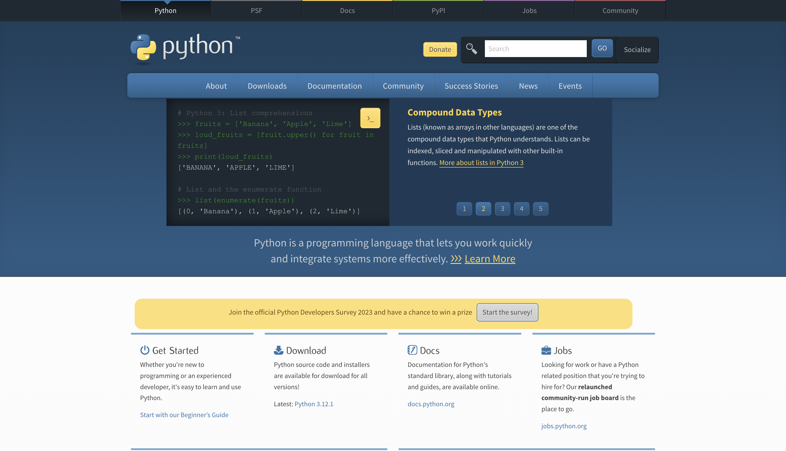
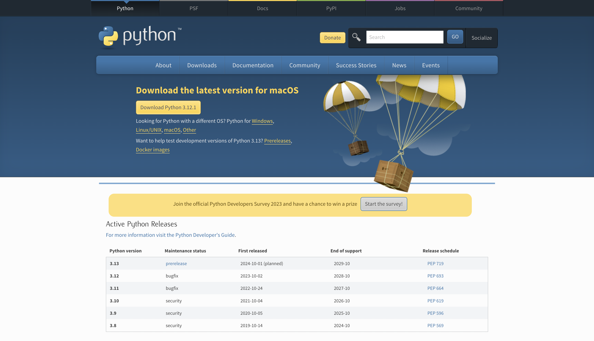
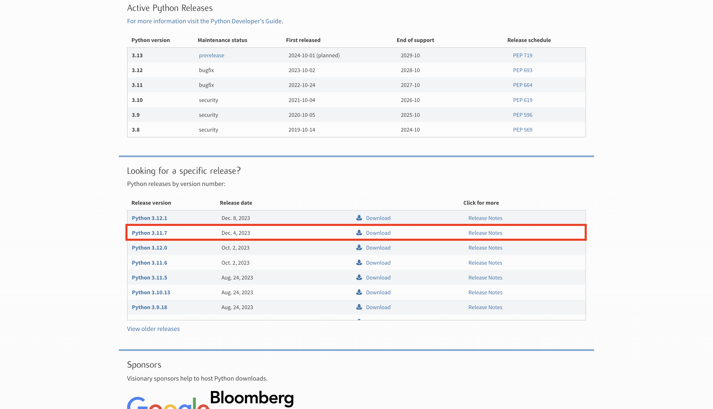
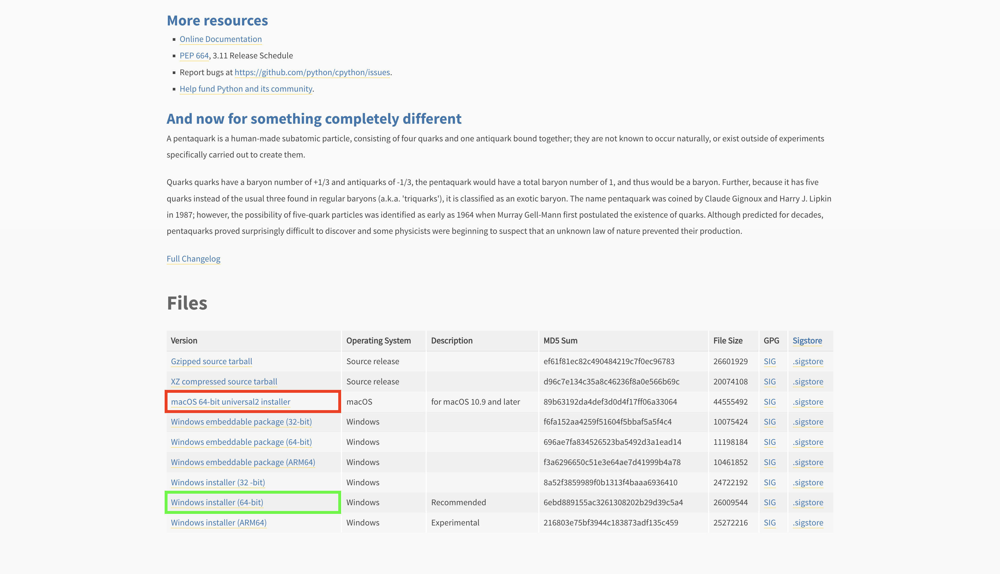
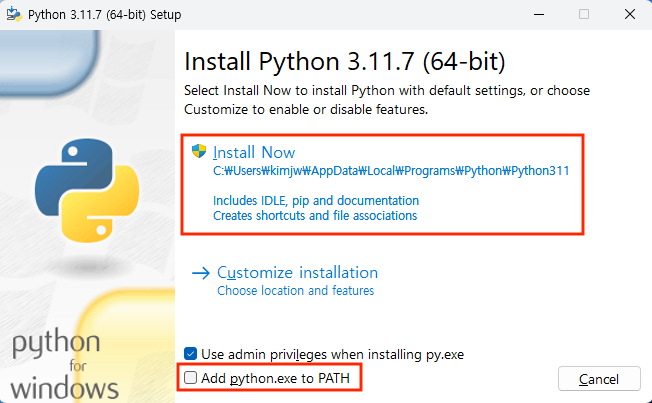

# 파이썬 설치 안내

## 1. 파이썬 공식 웹사이트 방문
- 파이썬을 설치하기 위해 먼저 파이썬의 공식 웹사이트인 <a href="https://www.python.org/" target="_blank">Python.org</a>에 접속합니다.


## 2. 다운로드 페이지로 이동
- 홈페이지 상단의 메뉴에서 "Downloads"를 클릭합니다. 

- 시스템에 맞는 파이썬 버전을 선택할 수 있습니다. 일반적으로 웹사이트는 사용자의 운영 체제(OS)를 감지하고 해당하는 최신 버전의 파이썬을 제안합니다.
- 여기서 우리는 3.11.7 버전을 선택하겠습니다.


## 3. 파이썬 설치 파일 다운로드
- 아래로 스크롤하다가 권장되는 버전의 "Download" 버튼을 클릭하여 설치 파일을 다운로드합니다.
- 각각의 운영체제에 맞는 파이썬 실행파일을 다운로드 해주세요 !
- Windows 사용자는 초록박스를, MacOS 사용자는 빨간박스를 확인하시고 다운로드 하시면 됩니다.


## 4. 설치 프로그램 실행
- 다운로드된 파일을 실행합니다.
:::warning
설치 시작 전 "Add Python `[버전]` to PATH" 옵션을 체크하는 것이 좋습니다. 이 옵션을 선택하면 파이썬이 시스템 PATH에 자동으로 추가되어 터미널이나 명령 프롬프트에서 파이썬을 바로 실행할 수 있습니다.
:::



## 5. 설치 진행
- "Install Now"를 클릭하여 설치를 진행합니다.

## 6. 설치 확인
- 설치가 완료되면, 터미널이나 명령 프롬프트를 열고 아래 명령어를 입력하여 설치된 파이썬의 버전을 확인할 수 있습니다.
```shellㅗㅎㄱ
python --version
# 또는 
python3 --version
```