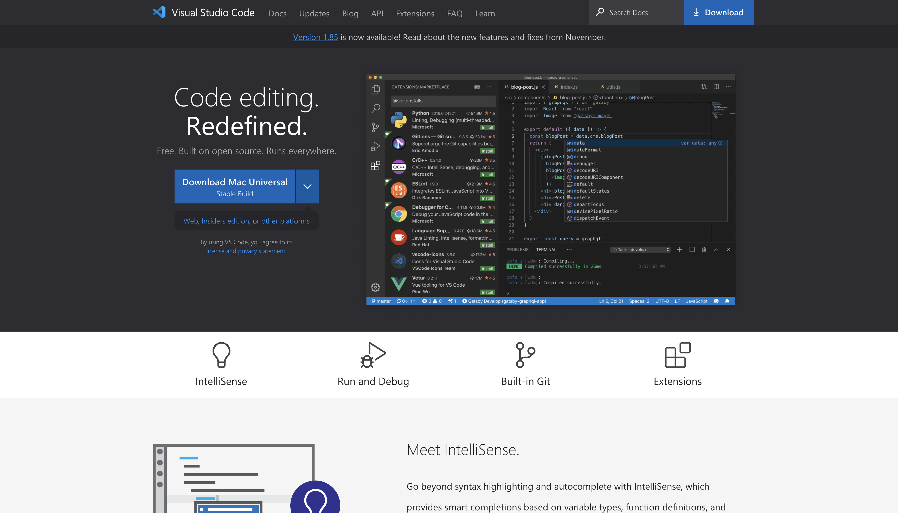
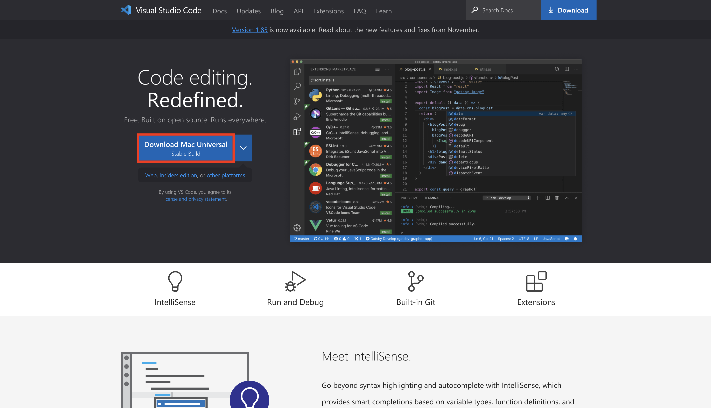
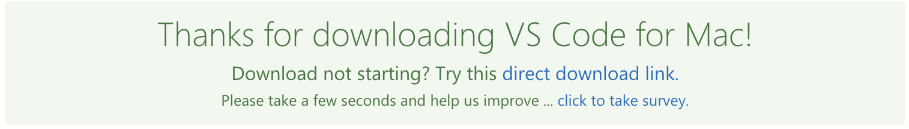
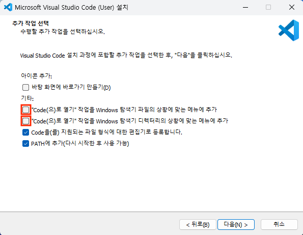
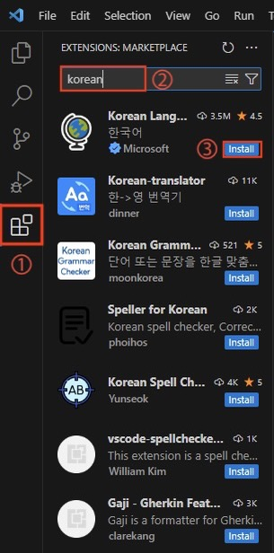
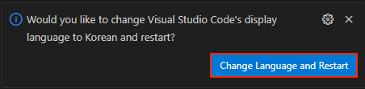
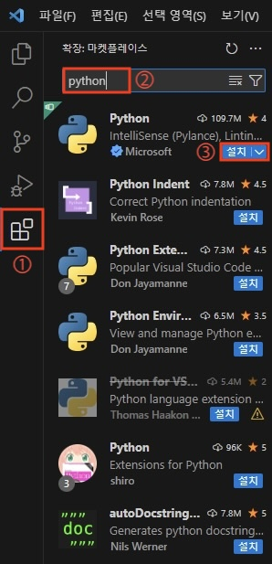
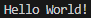

# 에디터
에디터(Editor)란 소스 코드를 편집할 수 있는 프로그래밍 도구를 말합니다. 에디터에는 여러 가지 종류가 있습니다.
- 파이썬 IDLE
- Visual Stidio Code
- PyCharm 
등

해당 블로그에서는 개발자들이 가장 많이 사용하는 Visual Studio Code(일명 VSC)를 설치하는 방법을 알아보겠습니다.

## 1. 파이썬 공식 웹사이트 방문
- VSC를 설치하기 위해 먼저 공식 웹사이트인 <a href="https://code.visualstudio.com" target="_blank">Visual Studio Code - Code Editing. Redefined</a>에 접속합니다.


## 2. 설치 파일 다운로드
- 시스템에 맞는 파이썬 버전을 선택할 수 있습니다. 일반적으로 웹사이트는 사용자의 운영 체제(OS)를 감지하고 해당하는 최적의 다운로드를 제안합니다.
- "Download `[OS]`"를 클릭합니다. ( OS 는 사용자의 운영 체제에 맞게 표시됩니다. )

- 버튼을 누르면 자동으로 다운로드 됩니다.

:::tip
만약 다운로드가 되지 않는다면 `direct download link.` 을 눌러주세요
:::



## 3. 설치 프로그램 실행
- 다운로드된 파일을 실행합니다.


## 4. 설치 진행
- 계속 다음을 누른 후 설치해주세요.

:::tip
추후 더욱 편하게 작업을 하고 싶으시다면 아래 두 옵션에 체크표시를 해주세요.
:::



## 5. VSC 세팅

### 1. 한글 설정
- 1. 아래 사진에서 `①` `( 확장 )` 를 클릭해주세요. 
- 2. `korean` 을 검색해주세요.
- 3. `Korean Language Pack for Visual Studio Code` 를 다운로드 해주세요.
- 4. 오른쪽 아래 나오는 `Change Language and Restart` 를 클릭해주세요.





### 2. 파이썬 확장 설치
- 1. 아래 사진에서 `①` `( 확장 )` 를 클릭해주세요. 
- 2. `python` 을 검색해주세요.
- 3. `설치` 를 클릭해주세요.



## 6. 파일 만들기
- VSC 메인 화면에서 `새 파일` 을 클릭 후 `Python 파일` 을 선택해서 새로운 파일을 만들어주세요.
```python
print('Hello World!')
```

위 코드를 복사해서 파일에 붙여넣기 해주세요.

`Ctrl + S` 를 눌러서 파일을 저장해주세요.

`Ctrl + F5` 를 누르면 프로그램이 실행됩니다.



제대로 작동되는 것을 확인했습니다.

이로써 파이썬을 실행하기 위한 모든 준비는 끝났습니다. 다음 강의부터는 파이썬 기본 문법에 대해 배워보도록 하겠습니다.
진행 과정에 문제가 있거나 질문이 있으면 댓글 부탁드립니다 :)


