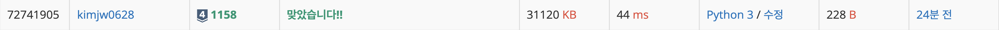

<https://www.acmicpc.net/problem/1158> ( 실버 IV )

### 문제
> 요세푸스 문제는 다음과 같다.<br><br>
1번부터 N번까지 N명의 사람이 원을 이루면서 앉아있고, 양의 정수 K(≤ N)가 주어진다. 이제 순서대로 K번째 사람을 제거한다. 한 사람이 제거되면 남은 사람들로 이루어진 원을 따라 이 과정을 계속해 나간다. 이 과정은 N명의 사람이 모두 제거될 때까지 계속된다. 원에서 사람들이 제거되는 순서를 (N, K)-요세푸스 순열이라고 한다. 예를 들어 (7, 3)-요세푸스 순열은 <3, 6, 2, 7, 5, 1, 4>이다.<br><br>
N과 K가 주어지면 (N, K)-요세푸스 순열을 구하는 프로그램을 작성하시오.

### 입력
입력첫째 줄에 N과 K가 빈 칸을 사이에 두고 순서대로 주어진다. (1 ≤ K ≤ N ≤ 5,000)<br>
### 출력
예제와 같이 요세푸스 순열을 출력한다.


예제 입력1
```
7 3
```
예제 출력1
```
<3, 6, 2, 7, 5, 1, 4>
```

## 풀이
```python
n, k = map(int, input().split())

people = list(range(1, n + 1))
result = []
index = 0

while people:
    index = (index + k - 1) % len(people)
    result.append(people.pop(index))

print("<" + ", ".join(map(str, result)) + ">")
```

N명의 사람이 원형으로 앉아 있고, K번째 사람을 순차적으로 제거합니다. 한 사람이 제거되면, 남은 사람들로 이루어진 원을 따라 이 과정을 계속합니다. 이 과정은 모든 사람이 제거될 때까지 계속됩니다. 최종적으로 사람들이 제거되는 순서를 요세푸스 순열이라고 합니다.

### 코드 설명

1. **변수 초기화**
   - `n`과 `k`는 사용자로부터 입력받아, 각각 원에 앉은 사람들의 총 수와 제거될 사람의 간격을 나타냅니다.
   - `people` 리스트에는 1부터 `n`까지의 숫자가 저장되어, 원에 앉은 사람들의 초기 순서를 나타냅니다.
   - `result` 리스트는 제거된 사람들의 순서를 저장하는 데 사용됩니다.
   - `index`는 다음에 제거될 사람의 위치를 추적하는 데 사용됩니다.

2. **순차적 제거**
   - `while people` 루프는 `people` 리스트에 요소가 남아 있는 동안 계속됩니다.
   - 각 반복에서, `index`는 `(index + k - 1) % len(people)`를 통해 계산됩니다. 이는 `k`번째 사람을 찾기 위한 것으로, 리스트의 범위를 넘어가지 않도록 모듈로 연산을 사용합니다.
   - `people.pop(index)`를 호출하여 계산된 위치의 사람을 제거하고, `result` 리스트에 추가합니다.

3. **결과 출력**
   - `result` 리스트에 저장된 순서대로 사람들이 제거된 순서를 출력합니다. 이때, `map(str, result)`를 사용하여 리스트의 요소를 문자열로 변환하고, `", ".join(...)`을 사용하여 쉼표로 구분된 하나의 문자열로 결합한 뒤 꺾쇠 괄호로 둘러싸서 출력합니다.


