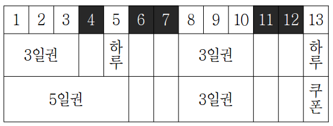
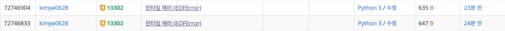
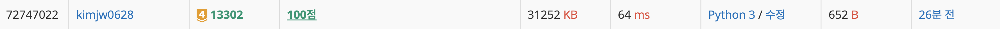

<https://www.acmicpc.net/problem/13302> ( 골드 IV )

### 문제
> 수영이는 여름방학을 맞이하여 많은 놀이 시설이 있는 KOI 리조트에 놀러가려고 한다. 리조트의 하루 이용권의 가격은 만원이다. 하지만 리조트의 규모는 상상을 초월하여 모든 시설을 충분히 즐기기 위해서는 하루로는 터무니없이 부족하다. 그래서 많은 이용객들은 3일 이상 연속으로 이용하기도 한다. KOI 리조트에서는 3일 연속 이용권을 할인된 가격 이만오천원에, 연속 5일권은 삼만칠천원에 판매하고 있다. 게다가 연속 3일권, 연속 5일권에는 쿠폰이 각각 1장, 2장이 함께 포함되어 있다. 쿠폰 3장은 하루 이용권 한 장으로 교환할 수 있다.<br><br>

> |이용권 종류|	가격	|쿠폰지급|
|:-----------------------------|:-----------------|:--------|
|하루 이용권|	10,000원	|없음|
|연속 3일권	|25,000원|	쿠폰 1장|
|연속 5일권|	37,000원|	쿠폰 2장|

> 연속 3일권과 연속 5일권은 구입일로부터 연속으로 3일 혹은 5일간만 이용이 가능하지만 해당 기간을 모두 이용할 필요는 없다.<br><br>
수영이는 N일의 여름방학 중 다른 일정으로 리조트에 갈 수 없는 날이 M일 있다. KOI 리조트를 사랑하는 수영이는 그 외의 모든 날을 KOI 리조트에서 보내고자 한다. 물론, 가장 저렴한 비용으로 리조트를 이용하고자 한다.<br><br>
예를 들어, 여름방학이 13일이라고 하고, 여름방학 기간 중 리조트에 갈 수 없는 날이 4번째, 6번째, 7번째, 11번째, 12번째 날이라고 하자. 다음 표의 첫 번째 행은 13일의 여름방학을 나타내고, 리조트에 갈 수 없는 날은 검정색으로 표시되어 있다. 표의 두 번째 행과 세 번째 행은 수영이가 이용권을 구입하는 두 가지 방법을 나타낸다. <br><br>
두 번째 행의 구입 방법은 다음과 같다. 여름방학의 첫 번째 날에 연속 3일권을 구입하여 3번째 날까지 리조트를 이용하고, 구매시 1장의 쿠폰을 받는다. 5번째 날에는 하루 이용권을 구입하여 이용한다. 8번째 날에는 연속 3일권을 구입하여 10번째 날까지 리조트를 이용하고, 역시 구매시 쿠폰 1장을 받는다. 13번째 날에는 하루 이용권을 구입하여 리조트를 이용한다. 이렇게 하여 수영이가 리조트 이용을 위해 지불한 전체 비용은 70,000원이다. <br><br>
세 번째 행은 더 저렴한 비용으로 리조트를 이용하는 구입 방법이다. 여름방학의 첫 번째 날에 연속 5일권을 구입하여 5번째 날까지 리조트를 이용하고(4번째 날 제외), 구매시 2장의 쿠폰을 받는다. 그리고 8번째 날에 연속 3일권을 구입하여 10번째 날까지 리조트를 이용하고, 역시 구매시 쿠폰 1장을 받는다. 13번째 날에는 그때까지 받은 3장의 쿠폰을 하루 이용권 한 장으로 교환하여 리조트를 이용한다. 이렇게 하여 수영이가 리조트 이용을 위해 지불한 전체 비용은 62,000원이다.<br>
<br>
여름방학 기간과 리조트에 갈 수 없는 날의 정보가 주어질 때, 리조트를 이용하기 위해서 수영이가 지불해야 하는 최소비용을 계산하는 프로그램을 작성하시오.

### 입력
표준 입력으로 다음 정보가 주어진다. 첫 번째 줄에는 수영이의 여름방학의 일수를 뜻하는 정수 N(1 ≤ N ≤ 100)과 수영이가 리조트에 갈 수 없는 날의 수 M (0 ≤ M ≤ N)이 순서대로 주어진다. M이 0인 경우 더 이상의 입력은 주어지지 않으며, M이 0보다 큰 경우 그 다음 줄에는 수영이가 리조트에 갈 수 없는 날이 1 이상 N 이하의 정수로 날짜 순서대로 M개 주어진다.<br><br>
예를 들어, M이 3이고 입력의 두 번째 줄에 정수 “12 14 17”이 주어진다면 여름방학의 12번째, 14번째, 17번째 날에는 리조트에 갈 수 없음을 의미한다. <br>
### 출력
표준 출력으로 주어진 입력에서 제시된 날들을 제외한 나머지 날 모두 리조트에 입장하기 위해서 지불해야 하는 비용의 최솟값을 출력한다.

### 서브태스크

|번호 |	배점 |	제한|
|:-----------------------------|:-----------------|:--------|
|1	| 11  |	N ≤ 5|
|2	| 17 |	M = 0|
|3	| 72 |	원래의 제약조건 이외에 아무 제약조건이 없다.|


예제 입력1
```
13 5
4 6 7 11 12
```
예제 출력1
```
62000
```


예제 입력2
```
50 10
3 5 7 11 15 16 22 23 24 34
```
예제 출력2
```
288000
```

## 풀이
```python
n,m=map(int,input().split())
u_days=list(map(int,input().split())) if m > 0 else []
inf=float('inf')

dp=[[inf]*106 for _ in range(106)]
dp[0][0]=0

for i in range(n+1):
    for j in range(40):
        if dp[i][j]==inf:
            continue
        result=dp[i][j]
        if i+1 in u_days:
            dp[i+1][j]=min(result,dp[i+1][j])
        if j>=3:
            dp[i+1][j-3]=min(result,dp[i+1][j-3])
            
        dp[i+1][j]=min(dp[i+1][j],result+10000)
        for k in range(1,4):
            dp[i+k][j+1]=min(dp[i+k][j+1],result+25000)
        for k in range(1,6):
            dp[i+k][j+2]=min(dp[i+k][j+2],result+37000)
print(min(dp[n]))
```

## 코드 설명

#### 동적 프로그래밍의 기본 원리

동적 프로그래밍은 복잡한 문제를 더 작은 하위 문제로 나누고, 각 하위 문제의 해답을 저장하여 중복 계산을 방지하는 방법입니다. 이 방식은 문제의 규모가 커질 때 계산 시간을 대폭 줄여주며, 주로 최적화 문제에 사용됩니다.

#### 코드의 동적 프로그래밍 적용

1. **상태 정의 (State Definition)**:
   - `dp[i][j]`: `i`일째에 `j`개의 쿠폰이 남아 있을 때까지의 최소 비용. 
   - 여기서 `i`는 0부터 `n`까지의 일자를 나타내고, `j`는 사용 가능한 쿠폰의 수를 의미합니다.

2. **초기화 (Initialization)**:
   - `dp` 배열은 모두 무한대(`inf`)로 초기화됩니다. 시작 시점에서 어떤 비용도 발생하지 않았다는 초기값입니다.
   - `dp[0][0]`은 0으로 초기화됩니다. 이는 첫째 날, 쿠폰가 없을 때의 초기 상태입니다.

#### 상태 전이 ( State Transition )
1. **여행이 불가능한 경우**:
   - **점화식**: `if i+1 in u_days: dp[i+1][j] = min(result, dp[i+1][j])`
   - **설명**: 여행이 불가능한 경우에는 비용이 추가되지 않습니다. 따라서 현재 비용(`result`)을 그대로 다음 날(`i+1`)로 전달합니다. 여기서 `min` 함수는 현재 비용과 이미 계산된 다음 날의 비용 중 더 작은 값을 선택하도록 합니다. 이는 여행이 불가능한 경우에는 추가 비용 없이 현재의 최적 상태를 유지합니다.

2. **쿠폰을 사용하여 다음 날로 넘어가는 경우**:
   - **점화식**: `if j >= 3: dp[i+1][j-3] = min(result, dp[i+1][j-3])`
   - **설명**: 이미 구매한 3일 또는 5일 이용권이 남아 있다면(`j >= 3`)(쿠폰이 3개 이상), 추가 비용 없이 다음 날로 넘어갈 수 있습니다. 이 경우, 사용한 쿠폰의 수(`j`)에서 3을 빼는 것은 쿠폰을 사용한 것을 반영합니다. 여기서도 `min` 함수는 여러 가능성 중 최소 비용을 선택합니다.

3. **이용권을 구매하는 경우**:
   - **하루 이용권 구매**:
     - **점화식**: `dp[i+1][j] = min(dp[i+1][j], result + 10000)`
     - **설명**: 하루 이용권을 구매하면, 현재 비용(`result`)에 10000원을 추가하고, 이 값을 다음 날의 최소 비용과 비교합니다. 여기서 10000원은 하루 이용권의 비용을 의미합니다.
   - **3일권 구매**:
     - **점화식**: `for k in range(1, 4): dp[i+k][j+1] = min(dp[i+k][j+1], result + 25000)`
     - **설명**: 3일권을 구매하는 경우, 현재 비용에 25000원을 추가합니다. 이 비용은 다음 3일간(`i+k`일)의 최소 비용을 갱신합니다. 여기서 쿠폰의 수(`j`)에 1을 추가하는 것은 새로운 3일권이 활성화되었음을 나타냅니다.
   - **5일권 구매**:
     - **점화식**: `for k in range(1, 6): dp[i+k][j+2] = min(dp[i+k][j+2], result + 37000)`
     - **설명**: 5일권을 구매하는 경우도 3일권과 유사합니다. 차이점은 이 비용이 다음 5일간 적용되고, 쿠폰의 수가 2개 증가한다는 점입니다. 또한 가격이 37000 으로 계산됩니다.

#### 핵심 원리

- **비용의 최소화**: 각 점화식은 해당 상황에서 가능한 최소 비용을 찾는 데 초점을 맞춥니다.
- **다양한 상황 고려**: 여행하지 않는 날, 쿠폰를 사용하는 날, 새로운 이용권을 구매하는 날 등 다양한 상황을 고려합니다.
- **결정의 전파**: 현재 결정이 미래의 상태에 어떻게 영향을 미치는지 계산합니다. 예를 들어, 3일권을 구매하면 이는 다음 3일 동안의 비용에 영향을 미칩니다.

#### 초보자를 위한 이해 포인트

- **동적 프로그래밍의 목적**: 최적의 해결책을 찾기 위해 모든 가능한 경우를 효율적으로 계산합니다.
- **점화식의 역할**: 각 상황에 대한 최적의 비용 계산 방법을 정의합니다.
- **최소 비용 선택**: `min` 함수를 사용하여 여러 가능성 중 최소 비용을 선택하는 것이 중요합니다.
- **결과 계산**: 마지막 날(`n`일째)에 도달할 때까지의 최소 비용을 `min(dp[n])`으로 계산합니다.

:::tip
문제를 풀다보면 

이런식의 에러가 발생하는 경우가 있습니다.
해당 에러는 EOFerror(End Of File) 에러로, 파이썬 입력이 끝날때까지 받는 경우 발생됩니다.
해당 코드를 보았을 때, 이는 m 이 0 일때 u_days 를 입력받을려고 해서 발생하는 문제로, 뒤에 `if m > 0 else []` 이런식으로 예외처리를 해주시면 해결됩니다.
:::
