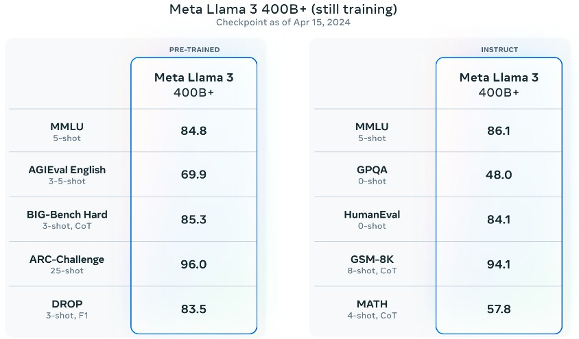

대규모 언어 모델에서는 더 크고 더 빠른 것이 더 좋다는 것이 일반적인 인식이지만, 실제로는 더 나은 성능이 더 중요합니다. Meta AI 연구팀이 Llama 모델군과 함께 했던 주요한 통찰 중 하나는, 모든 모델에서 최저 비용과 최고 성능의 AI 추론을 최적화하고, AI 훈련에서 발생할 수 있는 비효율성을 처리하는 것입니다.

이제 Llama 3을 통해 Meta Platforms는 AI 훈련과 추론 모두를 개선했으며, 최신 Google Gemini Pro 1.5, Microsoft/OpenAI GPT-4, 그리고 Anthropic의 Claude 3 모델들과 경쟁을 벌이고 있습니다.

원래의 Llama 1 모델은 2023년 2월, 그 오래전에 발표되었으며, 당시 다른 큰 LLM들과 어떻게 달랐는지 자세히 설명했습니다. 이 모델을 설명한 논문과 훈련에 사용된 오픈 소스 데이터셋은 이 링크에서 볼 수 있다. Llama 1 모델은 오픈 소스가 아니었지만, Meta Platforms는 신청한 연구자들에게 소스 코드를 제공했고, Llama가 결국 공개되었습니다.

Llama 1의 Meta Platforms는 매개변수가 상대적으로 적은 모델을 제공했습니다.( 7B, 13B, 33B, 65B ) 그리고 OpenAI와 Google의 훨씬 큰 GPT-3 175B와 PaLM 540B 모델과 견줄 수 있다고 Meta 는 이야기 했습니다. 초기 결과는 누구나 알 수 있었듯이 데이터가 매개변수보다 우세하다는 것을 보여주었습니다.

이것은 '더 많은 데이터가 더 나은 알고리즘을 항상 이긴다'는 Peter Norvig의 아이디어에서 비롯된 것으로, Norvig는 스탠포드 대학의 교육 펠로우이자 20년 이상 구글에서 연구자이자 엔지니어링 디렉터로 활동했으며, 2009년 '데이터의 비합리적 효과'라는 중요한 논문을 공동 저술했습니다.

Llama와 관련하여 중요한 것은 Meta Platforms가 추론 비용을 낮추고 성능을 높이는 데 초점을 맞추었다는 것입니다. Llama 모델은 모델 크기, 컴퓨팅 예산, 토큰 수, 훈련 시간, 추론 지연 및 성능에 이상적인 모델이 있다는 Chinchilla LLM의 기존 지혜에 도전했습니다. Meta Platforms는 가장 작은 70억 매개변수 모델을 가져와서 1조 개 이상의 토큰을 처리했고, Llama 1 7B는 더 적은 토큰으로 사색하는 것보다 계속해서 개선되었습니다. Llama 1 모델은 'Ampere' A100 GPU 2,048개로 훈련되었으며, 70B와 130B 모델은 1조 개의 토큰을 사용하고, 330B와 650B 모델은 1.4조 개의 토큰을 사용했습니다. Llama 1에 입력할 수 있는 프롬프트 데이터의 양은 불과 2,048 토큰이었습니다.

Llama 2는 2023년 7월에 출시되었으며, 이전의 LLaMA라는 철자는 이제 사용되지 않으며, 이제 그냥 Llama라고 부릅니다. Llama 2 모델은 2조 개의 토큰으로 훈련되었고, 매개변수 변형은 7B, 13B, 70B이며, 문맥 창은 4,096 토큰으로 두 배가 되었습니다. 오류와 환각을 줄이기 위해 100만 개의 인간 주석이 포함되었고, 테스트에서 약간 더 높은 정확도를 제공했습니다. 중요하게도, Llama 2 모델은 제대로 오픈 소스화되어 연구 및 상업용으로 자유롭게 사용할 수 있게 되었습니다. 이것이 장기적으로 PyTorch 프레임워크와 Llama 모델이 기업들에게 널리 사용될 것이라고 생각하는 이유입니다.

지난주, Meta Platforms는 Llama 3과 개선된 Meta AI 채팅 인터페이스를 출시했습니다. 이것은 Facebook, Instagram, WhatsApp, Messenger 애플리케이션에 내장되어 있으며 이제 Llama 3을 기반으로 합니다.

Llama 3 모델은 8B 및 80B 매개변수 변형을 포함하며, 이제까지 Meta Platforms는 800B 매개변수 모델을 만드는 유혹을 견뎌냈다. 이는 추론 컴퓨팅을 낮추고 따라서 비용을 낮추려는 시도 때문입니다. Llama 3은 놀라운 15조 개의 토큰에 대해 훈련되었으며, 그 중 5% 이상 – 약 8억 개의 토큰은 30개의 다른 언어로 데이터를 표현하는 데 사용되었습니다. Meta Platforms는 이 부분에 대해 토큰 수를 구체적으로 밝히지 않았지만, Llama 3 훈련에 비해 Llama 2에서 사용된 프로그래밍 언어 코드의 양이 4배 많았다고 했습니다. 흥미롭게도, Llama 2 모델은 이러한 수조 개의 토큰을 걸러내어 Llama 3 훈련에 추가할 적절한 데이터 세트를 식별하는 데 사용되었습니다. Llama 3의 소스 코드와 훈련 데이터는 GitHub 및 Hugging Face 등에서 사용할 수 있습니다. 모델 가중치와 토크나이저는 Meta Platforms에서 직접 제공된다.

Meta Platforms는 Llama 3 모델에 대한 다른 매개변수 수를 향후 제공할 수 있다고 시사했으므로, "더 크거나 작은 모델이 나올 가능성을 배제하지 말라"라고 하였습니다. 아직 Llama 3 기술 논문은 발표되지 않았지만, 발표에서 몇 가지 흥미로운 내용이 있었습니다.

"우리의 설계 철학에 따라, 우리는 Llama 3에서 상대적으로 표준적인 디코더 전용 트랜스포머 아키텍처를 선택했다" LLM을 연구한 수십 명의 연구자들이 Llama 3을 발표한 블로그에서 이야기한 내용입니다. "Llama 2와 비교할 때, 우리는 몇 가지 주요 개선을 했다. Llama 3은 128K 토큰의 어휘를 가진 토크나이저를 사용하여 언어를 훨씬 효율적으로 인코딩하며, 이는 모델 성능을 크게 향상시킨다. Llama 3 모델의 추론 효율성을 개선하기 위해, 우리는 8B 및 70B 크기 모두에서 그룹화된 쿼리 주의(GQA)를 채택했다. 우리는 8,192 토큰의 시퀀스에 대해 모델을 훈련시켰으며, 문서 경계를 넘어서 자기 주의(self-attention)가 이루어지지 않도록 마스크를 사용했다."

Meta Platforms는 Llama 3의 가장 큰 변형이 400B 이상의 매개변수를 가지고 있으며, 이는 아직 준비가 되지 않은 다른 기능들과 함께 발표될 것이라고 의심할 수 있다. 이 기능들은 Llama 3 스택의 일부이며, 다중 모달 처리, 다양한 언어로 대화, 그리고 더 큰 문맥 창을 포함할 수 있다. (아마도 Llama3는 여전히 Llama 2처럼 4,096 토큰일 것이지만, Meta Platforms는 발표에서 이에 대해 언급하지 않았습니다. Meta AI 챗봇에게 질문했을때, Meta AI는 4,096 토큰이라고 대답했습니다. ) 

Llama 3 모델은 Nvidia "Hopper" H100 GPU를 기반으로 하는 두 개의 클러스터에서 훈련되었으며, 하나는 Ethernet을 사용하고 다른 하나는 InfiniBand를 사용했습니다. Meta Platforms는 Llama 3의 가장 효율적인 구현이 16,000 GPU에서 실행되었으며, 모든 종류의 시스템 조정으로 인해 훈련이 Llama 2보다 3배 더 효율적이었다고 말했습니다. 그러나 컴퓨팅 이용률은 16,000 GPU에서 GPU 당 400 테라플롭스에 불과합니다. 스파서티가 꺼져 있고 FP16 반정밀도에서 실행될 때, H100은 989 테라플롭스로 평가되므로, 이는 컴퓨팅 효율성이 40.4퍼센트에 불과합니다. 스파서티 지원이 H100에서 실행 중이거나 데이터 형식이 FP8 4분의 1 정밀도였다면, 이는 컴퓨팅 효율성이 20.2퍼센트에 불과할 것이고, FP8에서 스파서티가 켜져 있었다면, 이는 단 10.1퍼센트의 컴퓨팅 효율성일 것입니다.

여기 Llama 3 7B와 70B가 다른 모델들과 "Instruct" 모드에서 어떻게 비교되는지에 대한 내용이 있습니다. 이 모드에서 모델들은 시험을 치르거나 수학 문제를 해결해야 합니다.

위 벤치마크는 대규모 다중 과제 언어 이해 벤치마크이며, 문맥 처리를 테스트합니다. 대학원 수준의 Google-Proof Q&A 다지선 테스트는 생물학, 물리학, 화학을 포함합니다, HumanEval 코드 생성 테스트, GSM-8K 초등학교 수학 테스트, 그리고 MATH 단어 문제 테스트입니다.

다음은 다섯 가지 다른 벤치마크에 대해 Llama 3 이 다른 모델들과 비교했을 때의 결과입니다.

AGIEval 영어는 대학 입학 시험의 혼합체이며 BIG-Bench Hard는 상식 추론을 테스트하는 일련의 논리 퍼즐입니다. 또, ARC-Challenge는 복잡한 대칭 패턴을 기반으로 하는 추상적 추론 말뭉치입니다. DROP은 문단 내용에 대한 이산적 추론을 의미하며, 이는 독해 테스트입니다.

Meta Platforms는 모델을 작게 유지하고 많은 데이터를 처리하는 것에 초점을 맞추었다고 강조했습니다. 이는 더 많은 시간과 컴퓨팅을 요구하지만, 좋은 결과를 낳습니다. 그러나 훈련이 더 비쌀 수 있지만, 추론은 비용이 적게 들어가는 것이 더 중요하다는 것입니다.

"Llama 3의 개발 동안 우리는 스케일링 동작에 대해 몇 가지 새로운 관찰을 했다," Meta Platforms의 기술자들은 말했다. "예를 들어, 8B 매개변수 모델에 대한 Chinchilla-최적의 훈련 컴퓨팅은 약 200B 토큰에 해당하지만, 모델 성능은 15T 토큰까지 훈련된 후에도 계속 개선된다는 것을 발견했다. 더 큰 모델은 이보다 적은 훈련 컴퓨트로 이러한 작은 모델의 성능을 달성할 수 있지만, 추론 중에 훨씬 더 효율적이기 때문에 일반적으로 작은 모델이 선호된다."

그리고 재미로 Meta Platforms는 사전 훈련된 벤치마크에서 Llama 3의 성능을 과시했습니다. 4000억 이상의 매개변수를 가진 모델이 이 테스트에서 GPA 83.9를 얻었고, 이는 확실한 B등급입니다. 작은 모델은 추론에서 빠르게 실행되지만, 분명히 더 큰 모델은 더 좋은 성적을 얻습니다.

