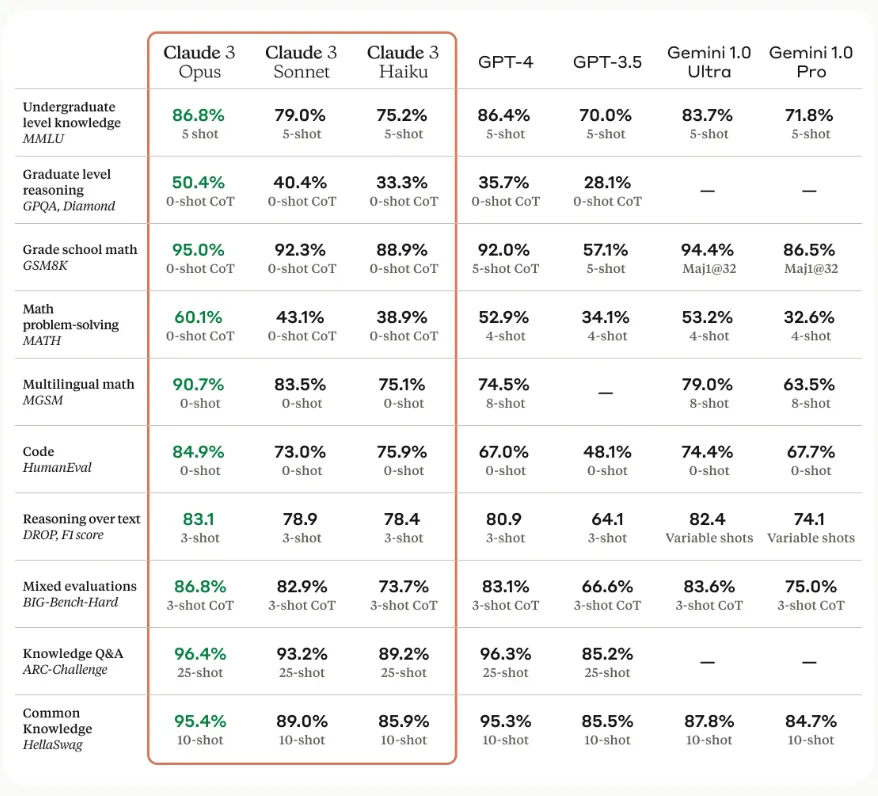
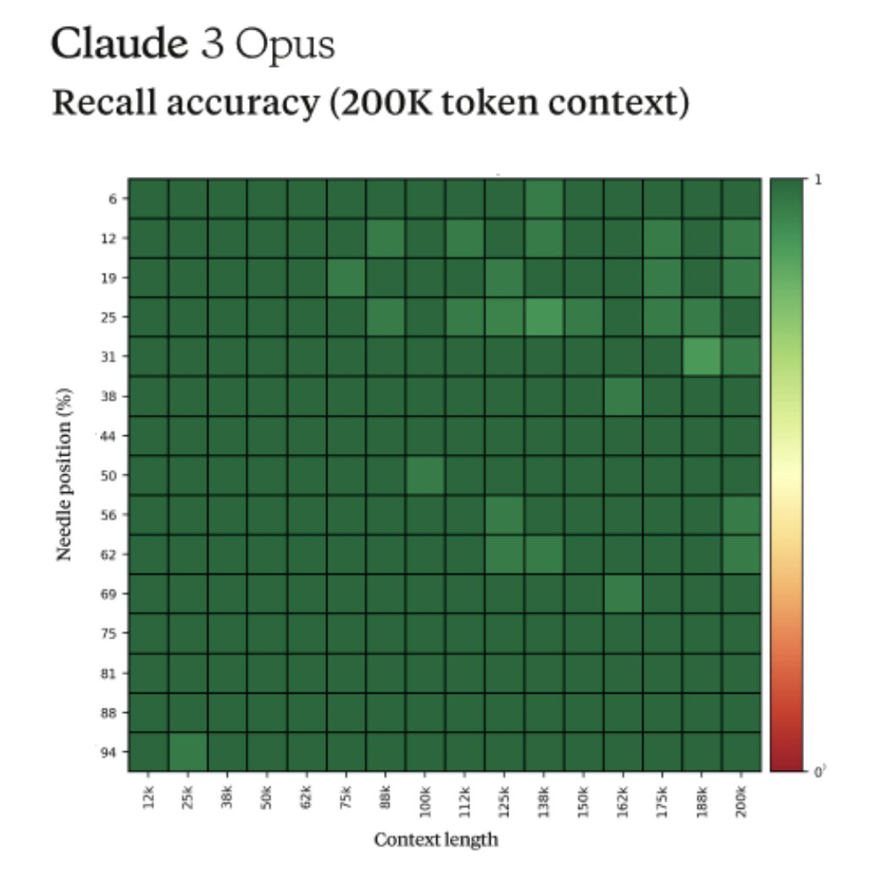

안녕하세요, 여러분! 오늘은 제가 최근 사용하기 시작한 Claude 3에 대해 이야기해 보려고 합니다.

ChatGPT와 GPT-4의 출시 이후, 저는 꾸준히 유료 버전을 사용해왔고 그 성능에 큰 만족을 느꼈습니다. 개인적인 성장과 업무적인 성장을 모두 이뤄낼 수 있었죠. 그런데 최근 앤트로픽에서 출시한 Claude 3가 제 눈길을 사로잡았습니다.

처음에는 무료 모델인 Sonnet을 사용해 보았는데, 너무 만족스러워서 바로 카드를 꺼내서 유료 모델인 Opus를 구매했습니다. 그리고 일주일 동안 Claude 3를 사용하면서, 정말 감탄을 금할 수가 없었습니다.

## Claude 3의 놀라운 한글 처리 능력

특히 한글로 결과물을 받아야 하는 경우에 Claude 3는 GPT 모델보다 훨씬 자연스럽고 인간적인 느낌을 줬습니다. 마치 한국인이 직접 글을 쓴 것 같은 자연스러운 어휘 선택과 문장 구성이 인상적이었습니다. ( 왠지... 나보다 글을 잘쓰는 느낌...?)

근데 이건 저만 느낀 것은 아닌거 같습니다. 실제로 Claude 3는 한국어 처리에 최적화된 알고리즘과 방대한 한국어 데이터셋을 바탕으로 학습되었다고 합니다. 자연어 처리 분야에서 '언어 모델의 현지화'가 중요한 화두로 떠오른 만큼, 앤트로픽이 한국어에 특화된 모델을 개발한 것은 매우 고무적인 일이 아닐 수 없습니다.

## 벤치마크 테스트로 살펴본 Claude 3의 객관적인 성능

앤트로픽에서 제공한 벤치마크 테스트 결과를 보면, Claude 3의 뛰어난 성능을 좀 더 객관적으로 확인할 수 있습니다.

대학교 학부 수준의 지식을 다루는 MMLU(Massive Multitask Language Understanding) 테스트에서 Claude 3의 최상위 버전인 Opus는 5-shot CoT 세팅에서 86.8%의 정답률을 보였고, 같은 세팅의 GPT-4는 86.4%를 기록했습니다. 이는 Claude 3가 광범위한 분야의 전문적인 지식을 갖추고 있음을 보여주는 결과입니다.

질의응답 능력을 평가하는 GPQA(Greedy Permutation Question Answering)에서는 Claude 3 Opus가 GPT-4를 크게 앞섰어요. 0-shot CoT 세팅에서 Claude 3 Opus는 50.4%의 정답률을 보인 반면, GPT-4는 35.7%에 그쳤습니다. 이는 Claude 3 Opus가 맥락을 고려한 추론 능력에서 GPT-4보다 우수하다는 것을 의미합니다.

수학 분야에서도 Claude 3 Opus의 성능이 두드러졌는데요. 대학 입시 수준의 수학 문제 해결 능력을 평가하는 MATH 벤치마크에서 Claude 3 Opus는 0-shot CoT 세팅으로 60.1%의 정답률을 보인 반면, GPT-4는 4-shot 세팅에서 52.9%를 기록했습니다. 또한 58개 언어로 출제된 수학 문제를 다루는 MG58에서도 Claude 3 Opus는 0-shot 세팅에서 90.7%의 정답률로 GPT-4의 8-shot 세팅 결과인 74.5%를 크게 앞섰죠.

코딩 능력을 평가하는 HumanEval에서도 Claude 3의 모든 버전(Opus 84.9%, Sonnet 73%, Haiku 75.9%)이 GPT-4(67%)를 압도하는 성적을 거두었습니다. 이는 실전 코딩 태스크에서 Claude 3가 GPT-4보다 우수한 성능을 발휘할 수 있음을 시사합니다.

이러한 결과들은 Claude 3, 특히 최상위 버전인 Opus가 자연어 처리, 지식 이해, 논리적 추론, 수학적 사고, 프로그래밍 등 다양한 인지 능력 측면에서 매우 높은 수준에 도달했음을 보여줍니다. 물론 GPT-4도 여전히 뛰어난 성능을 보이고 있지만, 일부 영역에서는 Claude 3에 밀리는 모습을 보이기도 했죠.

## Claude 3 Opus의 강점1 - 긴 글에서 핵심 정보 추출

Claude 3 Opus가 특히 빛을 발하는 부분은 바로 아무리 긴 글이라도 중요한 정보를 정확히 찾아내는 능력입니다. 마치 건초더미에서 바늘을 찾는 것처럼 말이죠.

앤트로픽의 프롬프트 엔지니어 Alex Albert에 따르면, Claude 3 Opus는 'Needle In A Haystack'이라는 테스트에서 90% 이상의 정확도를 보였다고 합니다. 이 테스트는 30개의 바늘과 질문 쌍을 숨겨놓고 모델이 그걸 얼마나 잘 찾아내는지 평가하는 방식으로 이루어집니다.

Claude 3 Opus는 거의 완벽에 가까운 리콜(Recall) 성능을 보여주었을 뿐만 아니라, 바늘에 해당하는 문장이 원본 텍스트에 인위적으로 삽입된 것으로 보이는 경우까지 인식해 냈다고 해요. 이는 Claude 3 Opus가 단순히 패턴 매칭에 그치지 않고, 글의 맥락과 의미를 깊이 있게 이해할 수 있음을 보여주는 결과입니다.

이러한 능력은 방대한 문서를 분석하거나 핵심 정보를 추출하는 데 있어 Claude 3 Opus가 큰 역할을 할 수 있음을 시사합니다. 연구자들이 수많은 논문을 읽고 필요한 내용을 찾을 때, 변호사들이 복잡한 법률 문서를 다뤄야 할 때, 기업에서 방대한 양의 보고서를 분석해야 할 때 등 다양한 분야에서 Claude 3 Opus의 활약을 기대해 볼 수 있을 것 같아요.

## Claude 3 Opus의 강점2 - 귀찮음이 없는 성실함

ChatGPT 4 모델의 가장 큰 이슈는 Lazy 현상과 코드 생략이라고 생각합니다. 몰론 ChatGPT 도 프롬프트 엔지니어링을 한다면 이러한 현상들이 나아지는 경험을 할 수 있습니다.
실제로 제 업무와 관련된 소스코드 작성을 요청해보았습니다. 하지만 ChatGPT 4는 제가 만족할만한 결과물을 제시해주지 못하였지만, Claude 3 Opus 모델은 제 만족 뿐만아니라, 다른 수정사항이나 추가점을 말해주면서 코드를 정말 상세하게 작성해줍니다. 이걸보고 '이제 정말 수년내로 AI 가 인간을 대체하는 날이 오겠구나' 라고 생각했습니다. + 속도도 정말 빠릅니다....

## 앞으로의 기대

Claude 3를 사용하면서 저는 인공지능 기술의 발전 속도에 놀라움을 금할 수 없었습니다. 불과 몇 년 전만 해도 상상하기 어려웠던 일들을 이제는 대화형 AI가 척척 해내는 걸 보면 정말 신기할 따름이에요.

물론 Claude 3가 만능은 아닙니다. 아직 개선해야 할 부분도 많고, 상황에 따라서는 GPT 모델이 더 적합할 수도 있죠. 하지만 Claude 3의 등장은 대화형 AI 기술이 한 단계 더 도약했음을 보여주는 사건이라고 생각합니다.

앞으로도 GPT-5를 비롯해 더욱 발전된 언어 모델들이 등장할 텐데, 그때마다 인공지능이 인간의 인지 능력을 얼마나 확장시켜줄 수 있을지 정말 기대가 됩니다. 번역, 요약, 창작, 분석 등 다양한 영역에서 인공지능과의 협업이 일상화되는 날이 머지않았다고 봅니다.

물론 이런 변화가 가져올 사회적, 윤리적 문제에 대해서도 깊이 있게 고민해야 할 것입니다. 하지만 인공지능 기술 자체의 발전은 거스를 수 없는 대세라고 생각해요. Claude 3의 등장은 그런 변화의 물결 중 하나의 사례일 뿐이죠.

앞으로도 Claude 3를 비롯한 다양한 대화형 AI들의 활약을 지켜보는 것은 정말 흥미로운 일이 될 것 같습니다. 여러분도 관심 있으시다면 꼭 한번 사용해 보시는 걸 추천드립니다.
