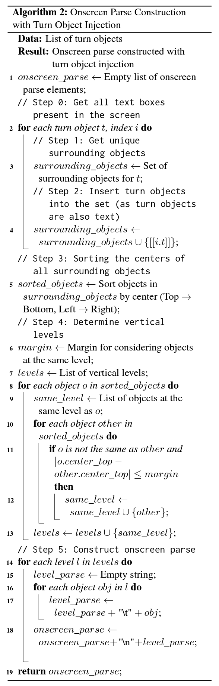
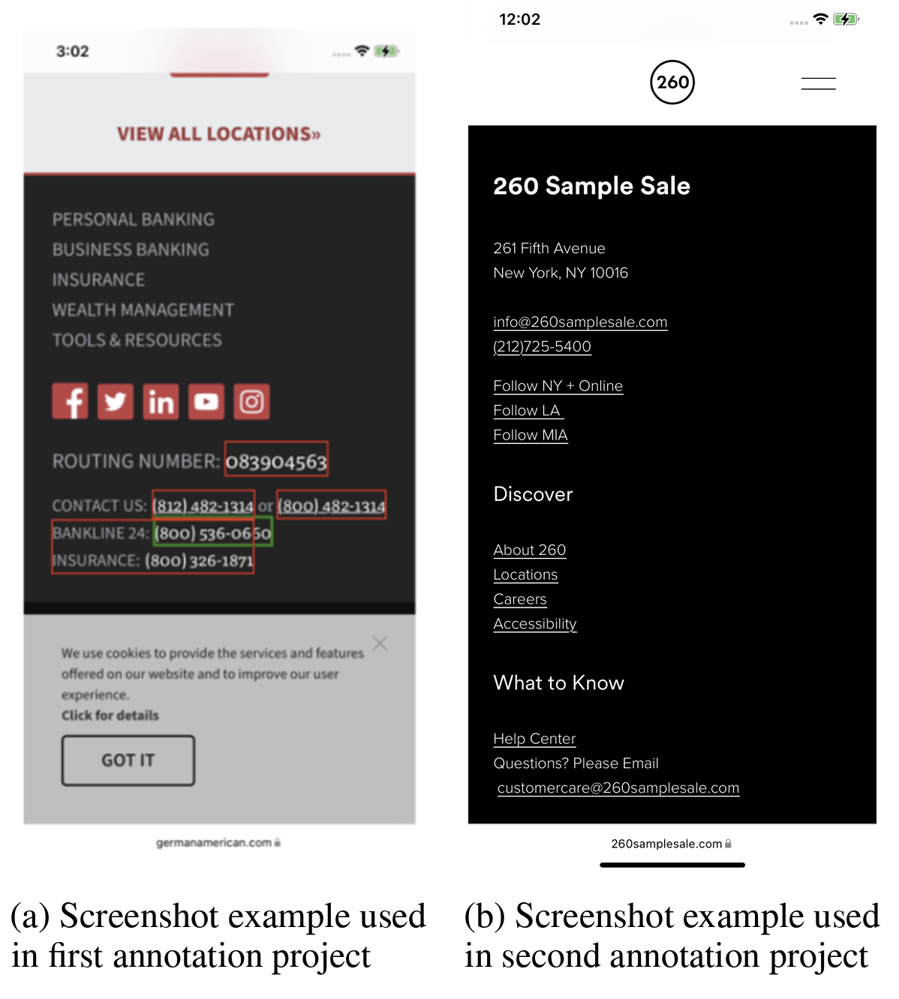
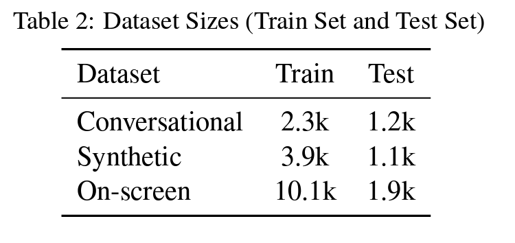
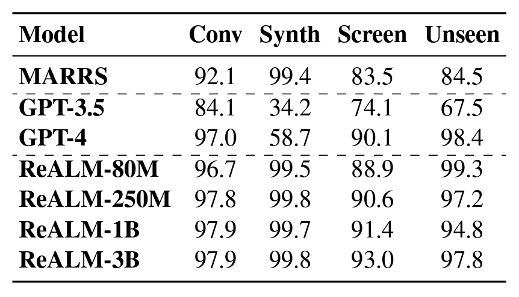
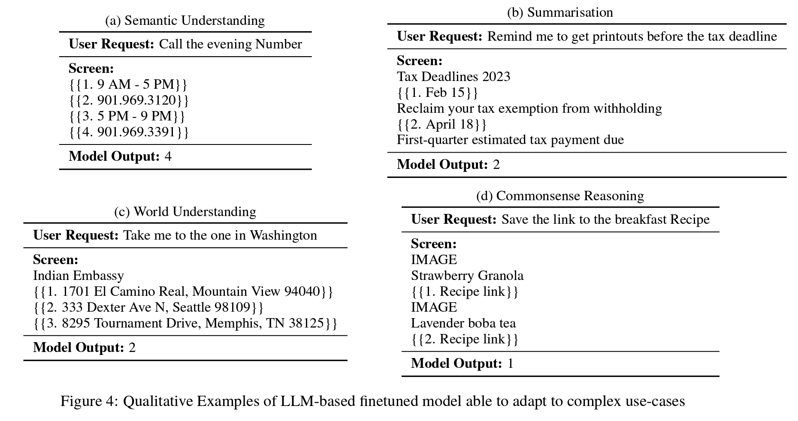

안녕하세요, 오늘은 Apple에서 개발한 최신 자연어처리 기술인 ReALM(Reference Resolution as Language Modeling)에 대해 심도있게 알아보려 합니다. ReALM은 대규모 언어 모델(LLM)을 활용하여 대화형 AI 어시스턴트의 참조 해결 문제를 다루는 획기적인 방법으로, 특히 On-Device AI에 최적화된 효율성이 돋보이는 기술이라 할 수 있습니다.

먼저 참조 해결이 무엇인지 간단히 설명드리면, 사용자가 대화 중에 "그것", "저것" 등 모호한 표현을 사용할 때 AI 어시스턴트가 맥락을 이해하여 정확한 대상을 파악하는 것을 말합니다. 기존에는 복잡한 규칙 기반 시스템을 사용했지만, ReALM은 LLM의 강력한 언어 이해 능력을 활용하여 이를 언어 모델링 문제로 재정의합니다.

ReALM의 핵심 아이디어는 대화 기록, 화면 정보, 백그라운드 엔티티 등 다양한 맥락 정보를 모두 텍스트로 변환하여 LLM에 입력으로 제공하는 것입니다. 특히 화면에 표시되는 정보를 텍스트화하는 것이 큰 도전 과제였는데, 연구진은 화면 엔티티의 위치와 주변 텍스트를 분석하는 새로운 알고리즘을 개발하여 이를 해결했습니다. 아래는 ReALM의 화면 엔티티 인코딩 알고리즘을 도식화한 것입니다.

이 알고리즘은 화면 엔티티들을 위치 정보에 따라 정렬하고, 일정 간격 내에 있는 엔티티들을 같은 줄에 배치하여 텍스트로 변환합니다. 이를 통해 LLM은 마치 실제 화면을 보는 것처럼 엔티티들의 상대적 위치를 이해할 수 있게 됩니다.

또한 ReALM은 대화, 화면, 합성 데이터 등 다양한 유형의 데이터셋을 활용하여 모델을 학습시켰는데요, 이를 통해 실제 사용 환경에서 발생할 수 있는 다양한 상황에 대처할 수 있는 강건성을 확보했습니다. 아래 표는 각 데이터셋의 규모를 보여줍니다.

풍부한 데이터를 바탕으로 학습된 ReALM은 실제 사용 환경에서의 다양한 상황에 강건하게 대처할 수 있습니다. 사전학습된 FLAN-T5 LLM을 파인튜닝하는 과정에서는 모델 크기에 따른 성능 비교도 수행하여, 최적의 효율성을 달성할 수 있었습니다.

특히 주목할 점은 ReALM이 기존의 대규모 LLM인 GPT-3.5나 GPT-4와 견줄만한 성능을 보인다는 것입니다. 아래 표는 ReALM과 다른 방법들의 성능을 비교한 것입니다.

비교 실험 결과, ReALM은 특히 화면 엔티티에 대한 참조 해결(Screen) 태스크에서 GPT-4와 비슷한 수준의 정확도(93.0%)를 달성했습니다. 나아가 보지 못한 도메인(Unseen)에서도 97.8%의 높은 성능을 보여, 범용성 측면에서도 뛰어난 모습을 보였습니다. 뿐만 아니라 제한된 컴퓨팅 자원을 가진 기기에서도 훌륭한 성능을 보여, On-Device AI에 최적화된 솔루션이라 할 수 있습니다.

On-Device AI 측면에서 ReALM의 장점은 더욱 두드러집니다. 모든 연산을 기기 내에서 처리하기 때문에 사용자 프라이버시 보호에 유리하고, 불안정한 네트워크 환경에서도 안정적으로 동작합니다. 또한 ReALM은 제한된 자원을 효율적으로 활용하도록 설계되어, 모바일/IoT 기기 등에 적은 비용으로 탑재될 수 있습니다.

마지막으로 ReALM은 정성 평가를 통해 단순 참조 해결을 넘어 의미 이해, 요약, 세계 이해, 상식 추론 등 복잡한 사용자 쿼리도 잘 다룰 수 있음을 확인했습니다. 이는 ReALM이 실제 대화형 AI 어시스턴트에 적용되었을 때, 사용자에게 훨씬 더 자연스럽고 만족스러운 경험을 제공할 수 있음을 시사합니다. 아래는 ReALM의 질의 응답 예시입니다.

종합하면 ReALM은 LLM의 장점을 극대화하면서도 경량화를 이룬 혁신적인 참조 해결 기술입니다. 풍부한 데이터로 학습하여 실제 환경에 강건할 뿐만 아니라, 작은 모델 크기에서도 GPT-4에 필적하는 성능을 보입니다. 또한 On-Device AI에 최적화되어 프라이버시를 보호하면서 효율적으로 동작합니다. 단순 참조 해결을 넘어 의미 이해, 추론 등의 고차원적 기능까지 갖춘 ReALM은 향후 대화형 AI 기술을 한 단계 도약시킬 것으로 기대됩니다. 다가올 미래, 우리는 ReALM과 같은 혁신 기술과 함께 AI 어시스턴트와 보다 자연스럽고 효과적으로 소통하게 될 것입니다.
