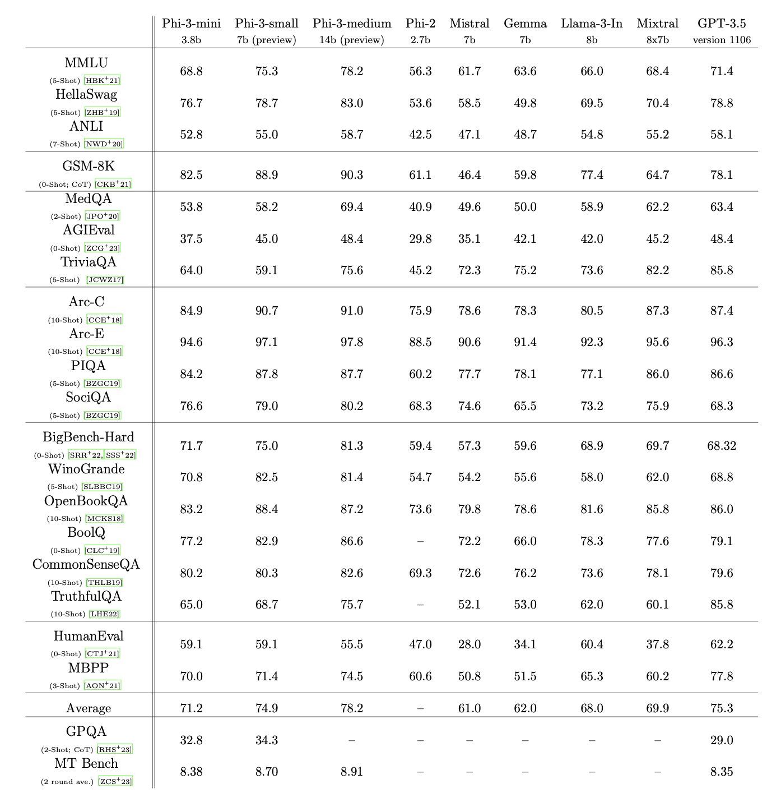
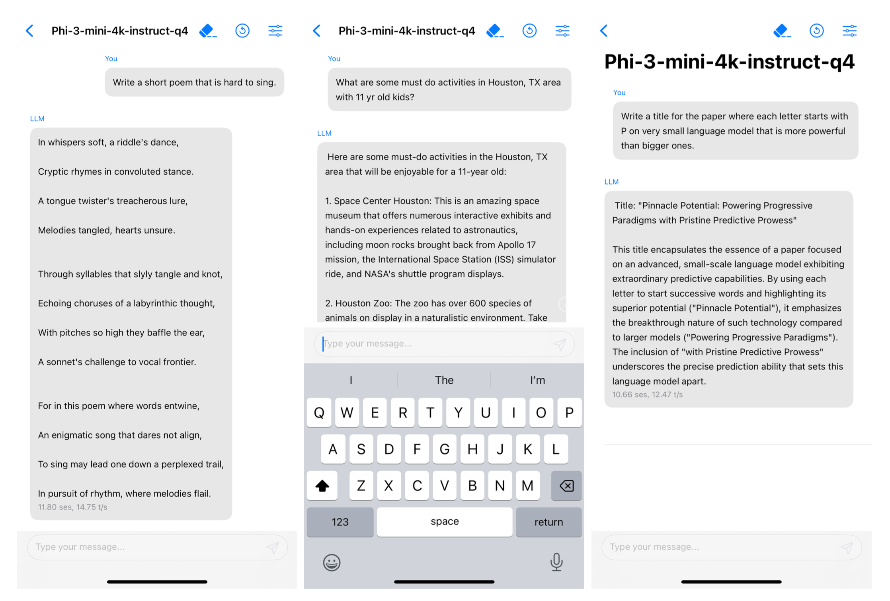

안녕하세요, 마이크로소프트에서 최근 새로운 소형 언어 모델인 Phi-3를 발표했습니다. 요즘 대용량 언어 모델(Large Language Model)보다는 소형 모델(Small Language Model)이 각광받고 있는데요, 스마트폰에서도 구동이 가능할 정도로 작으면서도 엄청난 성능을 자랑하는 모델들이 속속 등장하고 있습니다.

Phi-3는 GPT-3.5 수준의 성능을 내면서도 38억 개의 파라미터만을 사용해 매우 컴팩트한 것이 특징입니다. 최근 메타에서 공개한 LLaMA-3와 비교해도 모델 크기 대비 우수한 성능을 보여주고 있죠. 물론 클라우드나 서버용 대형 모델에 비하면 아직 부족한 점이 있지만, 개인정보 보호나 보안에 민감한 분야에서는 오히려 장점으로 작용할 수 있습니다.

마이크로소프트 연구진들은 데이터셋 최적화에 집중해 Phi-3의 기술적 한계를 극복했다고 합니다. 웹에서 수집한 양질의 데이터를 대규모 언어 모델로 필터링하고, 여기에 합성 데이터를 더해 학습 효율을 크게 높인 것이 핵심이라고 하네요. 이를 통해 단순히 모델 크기만 키우는 것이 능사가 아님을 보여주었습니다.

Phi-3는 여러 벤치마크 테스트에서 GPT-3나 LLaMA 같은 대형 모델과 견줄만한 성과를 거두었습니다. 물론 아직 사실 관계 추론 같은 분야에서는 한계를 드러내기도 했지만, 검색 기능을 접목하면 어느 정도 해결이 가능할 것으로 보입니다. 이는 모델의 기본적인 언어 이해 능력과 추론 능력이 이미 상당한 수준에 도달했음을 방증하는 것이기도 합니다.

흥미로운 점은 학습 데이터의 성격에 따라 모델의 편향성이 크게 달라진다는 사실입니다. Phi-3 연구진은 편향된 데이터를 제거하고 사용자 선호도를 직접 반영해 공정성과 안전성을 높이는 데 주력했다고 하는데요, 실제로 혐오 표현 생성률 등 여러 지표에서 큰 폭으로 개선된 모습을 보여주었습니다.

소형 언어 모델의 또 다른 큰 장점은 스마트폰이나 IoT 기기 등 엣지 환경에서의 추론 속도입니다. Phi-3는 아이폰 14의 A16 바이오닉 칩에서 초당 12개 이상의 토큰을 생성할 수 있을 정도로 빠른 속도를 자랑합니다. 모바일 기기의 제한된 자원 안에서 이 정도 성능을 끌어낸 것은 상당한 기술적 도전이었을 것으로 보입니다.

4비트 양자화, 롱 컨텍스트 확장, 블록 스퍼스 어텐션(Block Sparse Attention) 등 다양한 최적화 기법이 동원되었는데요, 덕분에 Phi-3 미니는 불과 1.8GB의 메모리 공간만으로도 구동이 가능하다고 합니다. 7B, 14B 파라미터를 가진 Phi-3 스몰, Phi-3 미디엄 모델도 함께 공개되어, 용도에 따라 적합한 모델을 선택할 수 있게 되었습니다.

특히 스트리밍 데이터의 실시간 처리나 개인화된 추천 등 엣지 컴퓨팅의 많은 영역에서 소형 언어 모델의 활약이 기대됩니다. 무거운 클라우드 연산을 최소화하면서도 고도화된 자연어 처리를 제공할 수 있게 된 것이죠. 마이크로소프트는 향후 다국어 처리 등으로 활용 범위를 넓혀갈 계획이라고 합니다.

물론 Phi-3가 완벽한 것은 아닙니다. 여전히 사실 관계 오류나 편향성 등의 과제가 남아있고, 적대적 사례에 대한 취약점도 있습니다. 하지만 지금까지 축적된 연구 성과와 커뮤니티의 노력이 더해진다면 충분히 개선해 나갈 수 있으리라 기대합니다. 중요한 건 기술 발전의 방향성일 것 같네요.

Phi-3의 등장은 곧 대중화될 '온디바이스 AI 시대'의 서막을 알리는 신호탄으로 보입니다. 클라우드 일변도였던 그간의 AI 기술이 우리 곁으로 한층 더 다가오게 된 것이죠. 개인정보 보호와 보안, 그리고 엣지에서의 빠른 추론까지 모두 충족하는 소형 언어 모델. 앞으로가 더욱 기대되는 이유입니다.

이상으로 마이크로소프트의 Phi-3 언어 모델을 살펴보았습니다. 한정된 자원 안에서 대형 모델에 버금가는 성능을 구현한 것이 인상 깊었는데요, 연구진들의 창의적인 접근과 끈질긴 노력이 돋보였습니다. 앞으로도 Phi-3와 같은 혁신적인 모델들이 계속해서 나오기를 기대해 봅니다.

여러분도 관심 있으신 분야가 있다면 논문을 찾아 읽어보시는 것을 추천드립니다. 방대한 분량에 주눅들 필요는 없어요. 시간을 갖고 차근차근 소화해 나가다 보면 어느새 그 분야의 전문가로 성장해 있는 자신을 발견하게 될 겁니다.

개인의 호기심과 끈기만 있다면 누구나 최첨단 AI 기술의 문을 두드릴 수 있습니다. 기술의 민주화가 가속화되고 있는 지금, 여러분 모두가 AI 혁신의 주역이 되기를 응원하겠습니다.
