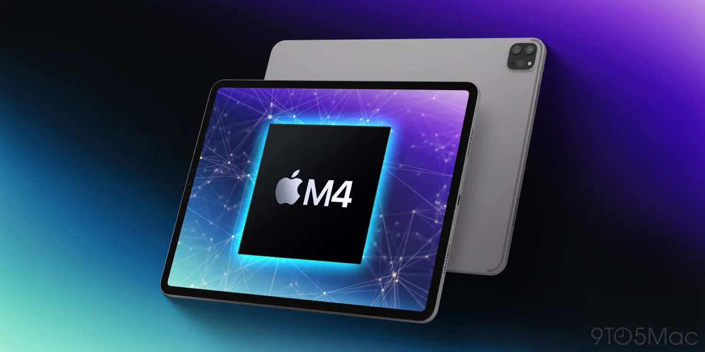
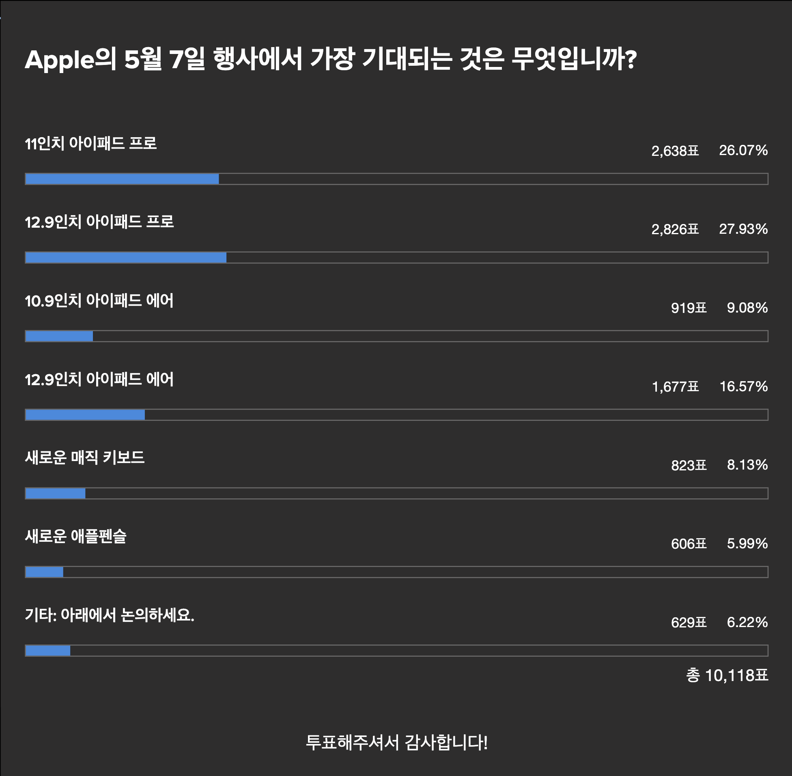
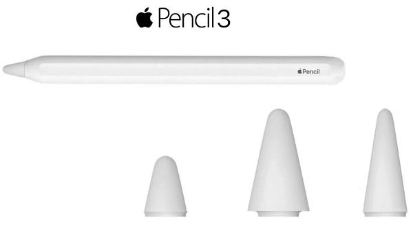
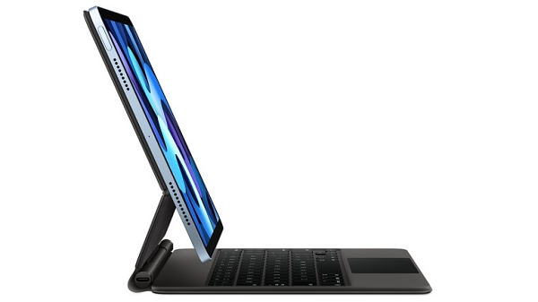
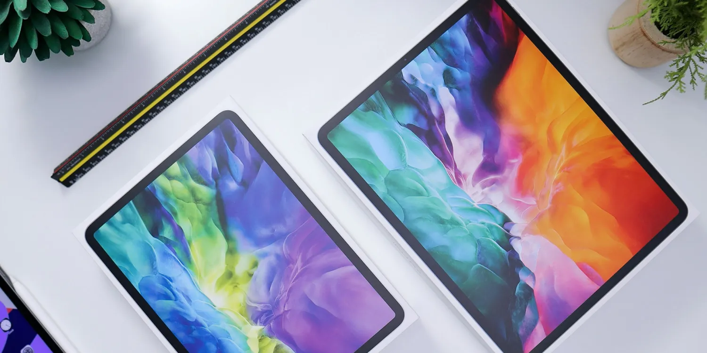

안녕하세요, 애플 제품 팬 여러분. 오늘은 많은 분들이 기다려 온 아이패드 프로 7세대와 에어 6세대의 최신 정보를 상세히 정리해 보려 합니다. 2년 만에 출시되는 신형 아이패드인 만큼 관심이 뜨거운데요, 그동안 다양한 루머와 유출 정보가 있었습니다. 이 포스팅에서는 그 내용을 총정리하여 업데이트해 드리겠습니다.

먼저 출시일과 공개 행사에 대해 알아보겠습니다. 애플은 오는 5월 7일 특별 이벤트를 개최하며, 이 자리에서 신형 아이패드 라인업을 공개할 것으로 예상됩니다.

지난 2년간 아이패드 프로 시리즈는 큰 변화 없이 유지되어 왔습니다. 그렇기에 이번 신형 모델에 대한 기대감이 특히 높은데요. 많은 분들이 디자인과 성능, 새로운 기능 등 다양한 부분에서 혁신을 기대하고 있습니다.

그중 단연 관심이 가장 높은 건 역시 M4 칩셋입니다. 당초 M3 탑재가 유력했으나, 최근 들어 M3를 뛰어넘는 M4 칩셋이 아이패드 프로에 먼저 적용될 것이라는 루머가 힘을 얻고 있죠.

M4는 M3 개발이 마무리되기도 전에 개발이 진행 중인 것으로 알려졌는데요. AI 및 머신러닝 성능에 특화된 칩셋으로, 애플이 아이패드의 AI 기능을 대폭 강화하고자 하는 의도로 해석됩니다. 기존 M1, M2 칩셋 대비 그래픽 성능도 크게 향상될 전망이라고 합니다.

이렇게 M4 칩셋이 먼저 아이패드에 탑재된다면, 하반기에 출시될 것으로 예상되는 맥북 프로 및 맥북 에어의 성능이 더욱 기대되는 대목입니다. 다만 일각에서는 아이패드가 맥북 라인업을 위협할 정도로 고성능화되는 것을 애플이 경계할 것이라는 분석도 있습니다.

한편, 신형 아이패드 프로에는 mini-LED가 아닌 OLED 디스플레이가 탑재될 것으로 보입니다. 현재까지 아이패드 시리즈에 OLED가 적용된 적은 없었죠.

신형 아이패드 프로에 탑재되는 OLED는 투스택 탠덤 OLED ( Two Stack Tandem )라고 불리는 차세대 OLED 기술이 적용될 것으로 예상되는데요. 이는 OLED의 장점은 그대로 유지하면서, 투 스택 탠덤은 발광층을 2개층으로 쌓기 때문에 발광층이 하나인 '싱글 스택'(Single Stack) 방식보다 화면 밝기는 2배, 수명은 4배 가까이 확대되는 것으로 알려져있습니다.

OLED는 삼성디스플레이 및 LG디스플레이 가 독점 공급하는 프리미엄 패널인데요. 지금까지 삼성 갤럭시 시리즈에도 탑재된 적 없는 기술이라고 합니다. 그만큼 아이패드 신제품에 대한 애플의 공을 엿볼 수 있는 대목이죠.

투스택 탠덤 OLED 탑재로 아이패드 프로는 박막 디스플레이의 장점을 극대화할 수 있습니다. 휴대성은 물론, 시야각과 야외 시인성, 저소비 전력, 블루라이트 감소 등 다양한 장점을 얻게 되는 셈이죠. mini-LED가 LCD의 한계를 극복하고자 했다면, 투스택 탠덤 OLED는 한 차원 더 높은 도약이 될 것으로 기대됩니다.

9to5mac 에서 조사한 결과에 따르면

11인치 및 12.9인치 아이패드 프로가 가장 많은 관심을 받고 있는 것으로 알려져있습니다.

성능과 디스플레이 못지 않게 관심이 높은 건 가격입니다. 디스플레이 교체와 최신 프로세서 탑재 등으로 BOM 원가가 상승할 수밖에 없는 상황인데요. 여기에 글로벌 공급망 이슈, 물가 상승까지 겹치며 가격 인상은 불가피해 보입니다.

현재 11인치 아이패드 프로 모델의 미국 출고가는 799달러입니다. 인상 폭을 100달러로 가정하면 899달러, 200달러 오른다면 999달러가 되는 셈인데요.

환율로 직접 계산하면 각각 118만원, 132만원 정도입니다. 그러나 한국 가격은 이보다 더 높게 형성될 가능성이 큽니다. 한국의 경우 부가세를 비롯한 제세 공과금이 추가로 부과되기 때문이죠.

때문에 인상폭이 100달러일 경우 139만원, 200달러일 경우 155만원 정도로 예상해 볼 수 있습니다. 물론 애플이 어떤 가격 정책을 펼칠지는 미지수입니다. 그러나 고객 저변 확대 차원에서 큰 폭의 인상은 피할 것으로 보입니다.

아이패드 프로 11인치 모델과 함께 12.9인치 모델도 업그레이드될 예정인데요. 12.9인치는 아이패드 프로 라인업의 플래그십 모델인 만큼, 한층 진화된 모습을 보일 것으로 기대됩니다.

12.9인치 모델의 예상 가격은 더 높습니다. 기본 모델 기준 1299달러로 유력한데요. 이는 한화로 176만원 수준입니다. 국내 출시가는 이보다 더 높은 150만원 중후반대가 될 가능성이 있습니다. 프로 모델 최상위 제품인 만큼 프리미엄을 더 받을 것으로 예상됩니다.

한편 아이패드 에어 6세대도 함께 출시될 것으로 보입니다. 아이패드 에어는 그간 프로 모델의 주요 기능을 일부 제외하고 합리적인 가격에 출시되어 인기를 끌어왔죠.

이번에는 10.9인치 모델과 12.9인치 모델 두 가지로 출시될 것으로 예상되는데요. 눈에 띄는 건 역시 12.9인치 대화면 도입입니다. 기존에는 12.9인치가 프로 모델에만 있었는데, 이를 에어 라인업에서도 선택할 수 있게 된 거죠.

12.9인치의 대화면은 생산성이나 멀티태스킹 면에서 큰 장점이 있습니다. 최근 아이패드가 노트북과 데스크톱을 대체하는 사례가 늘고 있는데요. 그런 면에서 에어 12.9인치 모델의 의미가 더욱 부각되고 있습니다.

또한 12.9인치 에어는 교육용 시장에서도 활용도가 높을 전망입니다. 프로 모델에 비해 저렴하면서도 넓은 화면으로 수업이나 과제에 최적화될 수 있기 때문이죠. 애플이 에어 모델에서 과감히 12.9인치를 도입한 건 시장 확대 의지로 해석됩니다.

다만 아이패드 에어는 OLED 대신 LCD 디스플레이가 탑재될 것으로 보입니다. 프로 모델과의 차별화와 원가 절감을 위해서죠. 아이패드 프로에만 들어가던 120Hz ProMotion 기술도 지원되지 않은 예정입니다.

프로세서는 M2 칩셋이 탑재될 가능성이 큽니다. 아이패드 프로의 M4 칩셋과 세대 차이는 나지만, 에어 모델 대비 상당한 성능 향상을 기대할 수 있습니다.

10.9인치 에어 모델의 가격은 기존과 크게 다르지 않을 것으로 예상됩니다. 64GB 모델 기준 599~699달러 선이 유력한데요. 이는 한화 약 90만원으로, 국내 출시 가격은 90만원 초중반대가 될 것으로 보입니다.

반면 12.9인치 에어 모델의 가격은 상당히 높을 것으로 예상됩니다. 899달러에서 999달러 사이가 될 것으로 보이는데요. 디스플레이 크기가 큰 만큼 원가 부담이 만만치 않기 때문입니다.

899달러일 경우 한화 약 120만원, 999달러라면 132만원 정도가 됩니다. 프로 12.9인치 모델과의 가격 차이를 두기 위해, 1,000달러 미만으로 책정될 가능성이 높아 보입니다.

이처럼 아이패드 프로와 에어 모두 전작 대비 괄목할 만한 진화가 예상됩니다. 특히 OLED 디스플레이 도입, M4 탑재 가능성 등은 많은 이들의 기대를 모으고 있는데요.

구매를 고민 중이신 분들이라면 신제품 출시 이후 실물 리뷰와 벤치마크 결과 등을 꼼꼼히 살펴보시길 추천드립니다. 성능과 가격, 디자인 등을 종합적으로 비교해 자신에게 최적화된 모델을 선택하는 것이 좋겠죠.

한편, 애플은 이번 아이패드 신제품과 함께 몇 가지 액세서리도 선보일 예정입니다. 가장 눈에 띄는 건 역시 애플펜슬 3세대인데요.

2세대 애플펜슬이 출시된 지 약 년 만에 선보이는 신제품입니다. 2펜 압력은 물론 기울기 감지, 손 글씨 인식 등 주요 기능이 대폭 향상될 것으로 기대되는데요. 특히 iPadOS와의 최적화를 통해 필기 지연 시간이 크게 감소하고 반응 속도가 빨라질 전망입니다.

또한 펜촉을 교체할 수 있게 되어 사용자 편의성도 높아질 것으로 보입니다. 현재 애플펜슬의 펜촉은 마모되면 교체가 불가능한데요. 이는 장기 사용 시 만족도를 떨어트리는 요인이었죠. 이를 개선해 펜촉을 자유롭게 교체할 수 있게 된다고 합니다.

무게는 약 15g 정도로 2세대와 비슷할 것으로 예상되는데요. 배터리 사용 시간은 12시간으로 늘어날 전망입니다. 기존 애플펜슬 2세대가 약 9시간 정도였던 것과 비교하면 약 30% 정도 향상되는 셈이죠.

가격은 199달러로 예상되며, 이는 한화 약 26만원 정도입니다. 2세대 출시가와 동일한 수준인데요. 애플펜슬의 경우 원가 대비 마진이 높은 액세서리로 알려져 있습니다. 때문에 가격 인상 없이 성능을 끌어올린 것으로 보입니다.

또 하나 주목할 만한 액세서리는 신형 매직키보드입니다. 아이패드 프로와 에어 모두에 대응하는 것으로 알려졌는데요. 현행 매직키보드가 출시된 지 3년 정도 지났기에 개선이 예상되는 부분입니다.

우선 키감이 더욱 향상될 것으로 보입니다. 기존 매직키보드는 나름대로 쫀득한 타건감을 자랑했지만, 장시간 사용 시 피로감이 있다는 의견이 많았죠. 새로운 매직키보드는 이런 부분들이 개선되어 한층 편안한 타이핑이 가능해질 전망입니다.

트랙패드도 더욱 커지고 정교해질 것으로 예상되는데요. 멀티태스킹이나 정밀 작업 시 큰 도움이 될 것으로 보입니다. 또한 터치감도 좋아져 제스처 사용이 더욱 손에 익숙해질 것으로 기대됩니다.

디자인 역시 변화가 있을 것으로 보입니다. 알루미늄 재질을 사용해 견고함은 높이면서도, 무게는 좀 더 가벼워질 전망인데요. 아이패드의 휴대성을 해치지 않으면서도 내구성을 확보할 수 있을 것으로 기대됩니다.

다만 가격은 기존보다 소폭 인상될 가능성이 있습니다. 349달러 정도가 될 것으로 예상되는데요. 한화로는 46만원 선입니다. 프리미엄 액세서리인 만큼 가격 부담은 있지만, 그만한 값어치를 할 것으로 보입니다.

이 외에도 USB-C to 3.5mm 잭 어댑터나 Apple Pencil과의 결합형 실리콘 케이스 등 다양한 액세서리 출시가 예상되고 있습니다. 아이패드의 활용도를 높이고 사용성을 개선하는 데 도움이 될 것으로 기대되는데요.

액세서리야말로 아이패드의 매력을 배가시키는 요소라 할 수 있겠죠. 본체의 성능 향상과 함께 주변기기의 진화도 기대해 볼 만한 이유입니다.

지금까지 아이패드 프로 및 에어 7, 6세대의 루머와 유출 정보를 살펴보았습니다. 아직 공식 발표 전이므로 확정된 사항은 아니지만, 그동안의 정보를 종합해 보면 대략적인 그림이 그려지고 있죠.

애플이 이번에는 iPadOS 17과의 시너지도 강조할 것으로 보입니다. 새로운 멀티태스킹 기능과 높아진 Apple Pencil 지원, 외부 모니터와의 연동성 강화 등이 예상되는데요.

하드웨어의 진화와 함께 소프트웨어의 발전도 기대해 볼 만합니다. 두 날개를 함께 강화함으로써 PC와 노트북을 넘어서는 아이패드 만의 독자적 가치를 증명할 수 있을 것으로 기대됩니다.

물론 아직 의문점도 있습니다. OLED 디스플레이의 번인 이슈나 M4 칩셋의 발열, 배터리 효율성 등은 실제 출시 이후 꼼꼼히 따져봐야 할 부분이죠.

가격 역시 변수입니다. 루머로는 대폭 인상이 점쳐지고 있지만, 물가 상승과 경기 침체라는 대내외 요인을 감안하면 애플도 신중히 접근할 것으로 보입니다. 아무리 혁신적인 제품이라도 너무 높은 가격은 오히려 역효과를 불러올 수 있기 때문이죠.

그럼에도 이번 신제품에 대한 기대감은 여전히 뜨겁습니다. 2년 만에 선보이는 아이패드 프로 시리즈인 만큼, 그동안의 기술 축적과 노하우가 집약될 것으로 예상되죠.

여기에 에어 라인업의 첫 12.9인치 도입은 또 다른 의미가 있습니다. 프로 모델에 버금가는 성능을 가격 부담을 줄여 제공함으로써, 시장 저변을 더욱 확대하는 계기가 될 전망입니다.

결국 중요한 건 사용자들의 경험입니다. 날로 치열해지는 태블릿 시장에서 아이패드가 독보적 위치를 유지할 수 있을지, 이번 신제품이 어떤 반응을 얻을 수 있을지 궁금해집니다.

제 개인적으로는 아이패드 프로의 OLED 디스플레이와 M4 칩셋의 시너지가 가장 기대됩니다. 최고 수준의 디스플레이 기술과 AP의 조합이라니, 그야말로 끝판왕급 성능을 예고하고 있죠.

물론 이를 위해선 적정 수준의 가격이 필수적입니다. 루머처럼 인상폭이 크다면 아무래도 구매를 주저하게 될 것 같네요. 혁신과 가성비의 조화가 필요한 대목이겠죠.

그래도 이번에는 저도 아이패드 프로 구매를 심각하게 고려 중입니다. 그동안 꾸준히 아이패드를 사용해 왔지만, 이번 신제품의 매력을 뿌리치기 쉽지 않을 것 같거든요. 일단 애플 이벤트를 주의 깊게 지켜본 뒤 결정해야겠습니다.

신형 에어도 상당히 매력적으로 보입니다. 특히 12.9인치 모델은 가격 대비 최고의 선택이 될 수 있을 것 같아요. 실제 출고가를 지켜봐야겠지만, 999달러 이하로 나온다면 상당한 수요를 끌어모을 것으로 예상합니다.

액세서리도 눈여겨볼 부분인데요. 3세대 애플펜슬의 블랙 컬러나 신형 매직 키보드의 기능 개선은 꽤 매력적이에요. 본체의 기능을 극대화할 수 있는 주변기기의 역할도 기대해 봅니다.

어쨌든 이번 신형 아이패드는 여러모로 주목할 만한 포인트가 많아 보이는데요. 애플이 어떤 비전으로 제품을 구성하고 차별화할 지 궁금해집니다. 함께 기대하며 지켜보시죠.

지금까지 2024년 상반기를 뜨겁게 달굴 아이패드 신제품에 대해 자세히 살펴보았습니다. 아직 미지수가 많은 만큼 단정 짓기엔 이르지만, 분명 역대급 라인업이 될 것으로 기대됩니다.

4월에 예고된 대로 5월 7일 7시 ( 한국 시간 11시 )에 정식 공개가 있을 텐데요. 그때까지 유출되는 소식을 꼼꼼히 체크하는 것도 구매에 도움이 될 것 같네요. 물론 최종 스펙과 가격은 현장에서 확인해야겠죠.

저 역시 이번 애플 이벤트를 주의 깊게 지켜보고, 신제품에 대한 리뷰와 소감을 전해드리도록 하겠습니다. 별도의 오프라인 행사도 준비하고 있으니 관심 가져주시면 감사하겠습니다.

긴 글 읽어주신 여러분 감사드리며, 앞으로도 애플과 아이패드 관련 소식을 발 빠르게 전해드리는 채널이 되겠습니다. 따뜻한 봄날의 설렘과 함께, 신형 아이패드에 대한 기대감도 함께 높아지길 바랍니다.

그럼 채널 구독과 알림 설정 부탁드리고, 댓글로 소통 나누시면서 유익한 정보 꼭 얻어가시길 바랄게요. 감사합니다!
