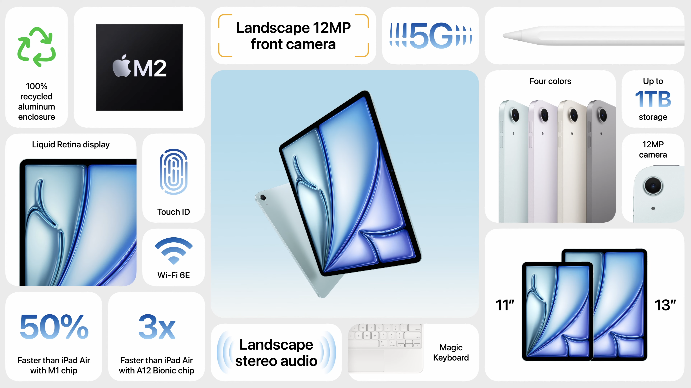
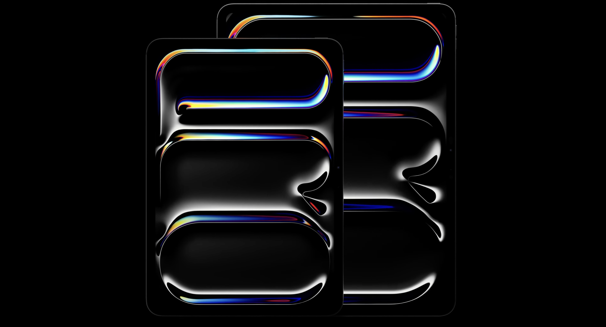
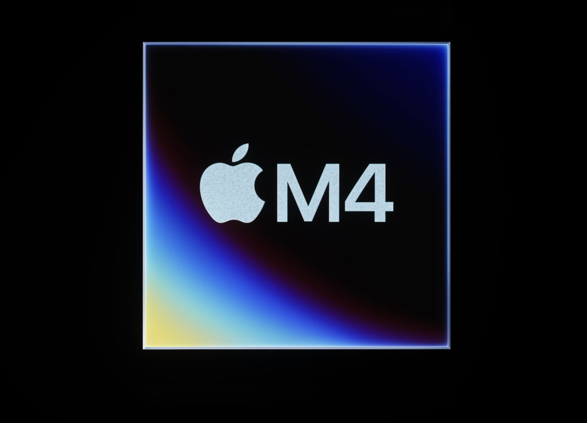
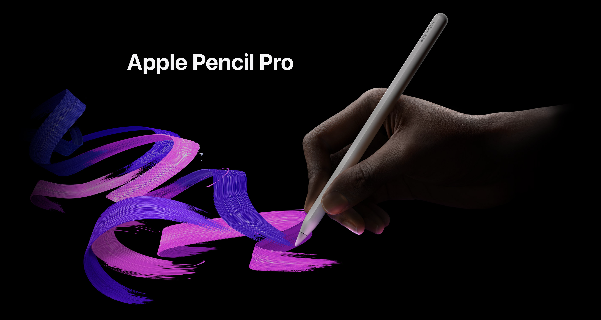
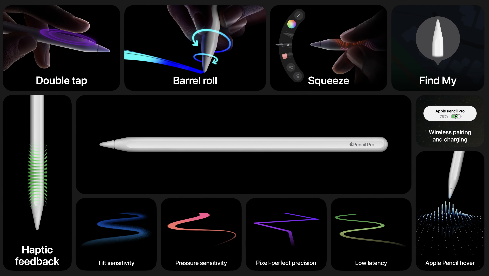

# 애플의 봄 신제품 발표회, 아이패드의 미래를 보다

안녕하세요, 2024년 5월 7일, 애플은 온라인 이벤트를 통해 아이패드 라인업의 대대적인 업데이트를 발표했습니다. 팀 쿡 CEO는 이번 행사를 "아이패드 출시 이후 가장 큰 날"이라고 소개하며, 새로운 아이패드 에어와 아이패드 프로, 펜슬, 키보드 등 다양한 신제품을 공개했는데요. 회사의 미래를 엿볼 수 있는 흥미로운 내용들이 많았습니다. 지금부터 행사 내용을 자세히 살펴볼까요?

## 진화하는 애플 비전 프로의 활용 사례

먼저 팀 쿡은 지난 2월 출시된 MR 헤드셋, 애플 비전 프로(Apple Vision Pro)의 다양한 활용 사례를 소개했습니다.

포르쉐는 비전 프로를 브랜드 경험과 정비사 교육, 미래 쇼룸 구축 등에 적극 도입하고 있다고 해요. 현장에서 바로 차량 정보를 불러오고, 실감 나는 시뮬레이션으로 정비 기술을 연마할 수 있게 된 거죠.

의료계에서는 샤프 헬스케어의 토미 콘 박사가 눈에 띄는데요. 수술 과정을 입체적으로 분석하고 최적화하는 데 비전 프로를 활용해 안과 수술의 정밀도를 크게 높였다고 합니다.

영화계에서는 뮤지컬 영화 '위키드'를 연출 중인 존 추 감독이 편집과 VFX 작업을 대형 스크린으로 원격 지휘한 사례가 소개되기도 했죠. 앞으로 비전 프로가 가져올 변화가 더욱 기대되는 대목입니다.

## M2 맥북 에어의 글로벌 히트

잠깐 macOS 이야기로 넘어가 볼까요? 지난 3월에 M2 칩을 탑재하고 새롭게 출시된 맥북 에어는 출시 직후부터 뜨거운 반응을 얻었다고 해요. 13인치와 15인치 씬앤라이트 노트북 시장에서 모두 판매량 1위를 차지하는 기염을 토했죠. 역시 애플 실리콘의 저력을 유감없이 입증한 셈입니다.

## 아이패드 에어, 한층 진화한 디자인과 성능

자, 이제 아이패드 라인업의 변화를 하나씩 들여다볼 차례입니다. 먼저 아이패드 에어는 11인치와 13인치, 두 가지 크기로 새롭게 출시되었어요.

11인치는 기존 디자인을 개선한 버전인 반면, 13인치는 프로의 영향을 받아 완전히 새롭게 탄생한 모델이라고 볼 수 있겠네요. 13인치는 11인치보다 화면이 30% 더 넓어서 멀티태스킹에 최적화되어 있습니다. 개인 작업이나 팀 프로젝트, 영상통화 등에서 높은 생산성을 자랑할 것 같아요.

성능 면에서는 M2 칩 탑재로 이전 모델 대비 50%나 향상되었습니다. CPU와 GPU 속도는 물론, 신경망 엔진도 한층 빨라졌죠. 고사양 게임부터 전문가용 사진 보정 앱까지 부드럽게 구동할 수 있는 여유가 생겼어요.

디자인적으로는 프론트 카메라가 프로처럼 가로 모드 사용에 최적화된 위치로 옮겨갔습니다. 영상통화 시 자동으로 프레임을 조정해주는 '센터 스테이지' 기능도 새롭게 지원하고요.

음향 쪽에서는 13인치 모델이 저음 재생력을 2배로 높인 4 스피커 시스템을 갖췄습니다. 공간 음향까지 지원하니 영화 감상이나 게임에서 생생한 사운드를 즐길 수 있겠네요.

색상도 기존의 스타라이트, 스페이스 그레이에 더해 시원한 블루, 따뜻한 퍼플이 추가되어 취향에 맞게 선택할 수 있게 되었고요.

스토리지는 128GB부터 시작해 1TB까지 다양하게 준비되어 있습니다. 11인치의 경우 $599, 13인치는 $799부터인데요. 교육, 비즈니스, 크리에이터 등 다양한 사용자의 니즈를 폭넓게 충족시켜 줄 것으로 기대됩니다.

## 놀라운 변신, 차세대 아이패드 프로

아이패드 프로의 변화는 더욱 놀라웠습니다. 말 그대로 기존 태블릿 PC의 한계를 뛰어넘는 도전이었다고 할 수 있을 것 같아요.

### 극한의 슬림함과 가벼움 추구

우선 견고함을 유지하면서도 경이로울 정도로 얇고 가벼워진 디자인이 인상적이었습니다. 11인치가 5.3mm, 13인치가 5.1mm 두께로, 그간 최초의 얇은 기기로 회자되던 iPod nano보다 훨씬 더 얇은 두께를 자랑했죠.

무게 역시 13인치가 기존 모델 대비 113g이나 가벼워져서 휴대성이 크게 개선되었습니다. 이렇게 슬림해진 배터리 설계 덕분에 1파운드(약 454g) 이하의 가벼운 무게를 실현할 수 있었다고 해요.

마감재로는 100% 재활용 알루미늄이 사용되었고, 실버와 스페이스 블랙 두 가지 색상으로 출시됩니다.

### 화질의 새로운 기준, 탠덤 OLED 디스플레이

디스플레이 혁신도 놀라웠어요. 애플은 이번에 기존 OLED 패널의 한계를 뛰어넘는 '탠덤 OLED' 기술을 새롭게 선보였습니다.

OLED 기술은 각 픽셀이 스스로 빛과 색을 생성해 뛰어난 정밀도를 자랑하지만, 아이패드 프로처럼 큰 화면에 적용하기에는 밝기가 충분치 않다는 단점이 있었죠.

애플은 이를 극복하기 위해 두 장의 OLED 패널을 겹쳐 사용하는 탠덤 OLED 구조를 고안해냈습니다. 두 패널에서 나오는 빛을 합쳐 놀라운 수준의 전체 화면 밝기를 구현해낸 것이죠.

그 결과 기존 LCD로는 도달할 수 없었던 1,000니트의 전면 밝기와 1,600니트의 HDR 피크 밝기를 실현했습니다. 여기에 섬세한 색 표현과 깊고 선명한 블랙, 디테일한 그림자 표현력까지 더해져 프리미엄 미니 LED 패널을 뛰어넘는 화질을 자랑합니다.

이른바 '울트라 레티나 XDR'로 명명된 이 디스플레이는 프로 사용자들의 기대치를 한 차원 높여줄 전망인데요. 예술 작품의 세밀한 터치부터 영화의 생생한 장면까지, 섬세하고 사실적인 시각 경험을 제공할 것으로 기대됩니다.

나아가 애플은 눈부심 방지를 위한 나노 텍스처 글래스 옵션도 함께 공개했어요. 덕분에 야외에서도 작업이나 여가 활동에 몰입할 수 있게 되었죠.

이처럼 탠덤 OLED는 하드웨어와 소프트웨어가 결합된 애플 특유의 기술 혁신을 보여주는 사례라 할 수 있을 것 같습니다. 전문가는 물론 일반 사용자들의 눈을 만족시킬 수준 높은 디스플레이 경험을 기대해 봅니다.

### PC를 압도하는 차세대 애플 실리콘, M4 칩의 등장

이번 애플 신제품 발표회에서 단연 눈길을 끈 것은 아이패드 프로의 심장부를 책임질 새로운 프로세서, M4 칩의 등장이었습니다. 7개월 전 데뷔한 M2의 뒤를 이어 애플 실리콘의 새로운 이정표를 제시한 것인데요. 성능은 물론 전력 효율성까지 크게 향상된 것이 특징입니다. 과연 M4는 어떤 혁신을 담고 있을까요?

첨단 공정과 설계 혁신이 빚어낸 걸작

무엇보다 M4는 최첨단 제조 공정을 통해 탄생했습니다. 세계 최고 파운드리로 꼽히는 TSMC의 3나노 2세대(N3E) 공정이 적용되었는데요. 3나노 공정은 실리콘 웨이퍼 위에 새겨지는 트랜지스터의 크기가 불과 수 나노미터에 불과할 정도로 미세한 제조 기술을 말합니다.

이를 통해 M4는 같은 면적 대비 훨씬 더 많은 트랜지스터를 집적할 수 있게 되었죠. 애플에 따르면 M2 대비 무려 25% 더 많은 1000억 개 이상의 트랜지스터가 M4에 담겼다고 합니다. 여기에 배선 간격을 최적화하는 EUV 기술까지 더해져 칩 크기는 더욱 작아지고, 에너지 손실은 크게 줄어들었습니다.

물론 공정 혁신에 더해 설계상의 개선도 M4의 놀라운 성능을 뒷받침하는 요소입니다. 우선 CPU는 고성능 코어 4개, 에너지 효율 코어 6개로 구성된 10코어 설계를 채택했는데요. M2 대비 코어 수는 그대로 유지하면서도 IPC(클럭당 명령어 실행 수)를 대폭 끌어올렸습니다.

여기에는 명령어 예측 성능을 높여주는 브랜치 프리딕터 개선, 연산 병목 현상을 해소하는 실행 유닛 확장, 코어 간 데이터 전송을 원활히 하는 온칩 인터커넥트 최적화 등 다양한 마이크로아키텍처 혁신이 적용되었죠. 그 결과 M4의 CPU는 싱글 스레드 성능에서 M2를 50%나 앞지르는 괴력을 보여줍니다.

또한 CPU에는 애플 뉴럴 엔진과의 연동을 강화하는 AMX(Advanced Matrix Extension) 유닛이 통합되었습니다. 기계학습 연산에 최적화된 전용 하드웨어로, 행렬 계산이 필요한 알고리즘의 처리 속도를 크게 높여준다고 하네요. 덕분에 사진 속 피사체 분리나 음성 인식 같은 로컬 AI 작업에서 더욱 뛰어난 성능을 뽑아낼 수 있게 되었습니다.

#### PC를 압도하는 그래픽 성능과 미디어 가속

그래픽 성능에서도 M4는 큰 진전을 이뤘습니다. M2에서 10코어로 업그레이드된 GPU는 M4에서도 그대로 이어졌는데요. 다만 개별 코어의 연산 능력이 크게 향상되어, 전체적인 GPU 성능은 무려 35%나 높아졌다고 합니다.

특히 M4 GPU는 최신 그래픽 기술을 완벽 지원한다는 점에서 주목할 만합니다. 먼저 게임 최적화 기술로 각광받는 메탈3 API를 하드웨어 가속하도록 설계되었는데요. 텍스처 압축이나 프리미티브 셰이딩 같은 고난도 기술을 칩 레벨에서 처리할 수 있게 됐죠.

여기에 더해 하드웨어 레이트레이싱도 지원합니다. 레이트레이싱은 사실적인 광원, 그림자, 반사 효과 등을 구현하는 렌더링 기술로, 주로 고성능 GPU에나 적용되던 기술이었는데요. 이제 아이패드 프로에서도 데스크톱 수준의 게임과 AR 앱을 구동할 수 있게 되었습니다.

콘텐츠 제작에서도 M4의 강점은 두드러집니다. ProRes나 HEVC 같은 전문가용 코덱을 완전히 하드웨어로 가속하는 비디오툴즈 엔진이 통합되었거든요. 4K 멀티캠 편집이나 8K 원본 영상 디코딩 같은 작업에서 놀라운 성능을 보여줍니다.

특히 Final Cut Pro에서 멀티캠 편집 시 M2 대비 2배 이상 빨라진 렌더링 속도를 뽑아낸 것은 M4의 미디어 역량을 단적으로 보여주는 대목이라 하겠습니다.

#### 60배 성능 높인 뉴럴 엔진, AI 혁명의 중심에 서다

M4에서 가장 크게 진화한 부분을 꼽자면 단연 뉴럴 엔진일 것입니다. 애플의 커스텀 AI 프로세서로, M1 시리즈에서부터 그 위력을 발휘해온 비결이기도 한데요.

M4는 여기에 한층 더 강력한 성능을 더했습니다. 정확히는 16코어 구성의 5세대 뉴럴 엔진을 탑재해, 초당 최대 38TeraOPS(1조 연산)의 처리 능력을 자랑합니다. 이는 불과 1세대 전인 M2의 22TeraOPS에 비해 무려 72%나 높아진 수치입니다.

5년 전 아이폰X의 A11 바이오닉에 처음 뉴럴 엔진이 도입되었을 당시와 비교하면 그 성장세는 더욱 놀랍니다. 당시 0.6TeraOPS에 불과했던 AI 연산량이 무려 60배 이상 늘어난 것인데요. 모바일 기기의 AI 성능이 얼마나 빠른 속도로 진화하고 있는지 실감케 하는 대목이라 하겠습니다.

뉴럴 엔진의 고성능이 빛을 발하는 것은 로컬 기기에서 동작하는 AI 모델 덕분인데요. 실시간 이미지 인식, 자연어 이해, 동작 추적 등 다양한 인공지능 작업을 사용자 기기에서 직접 수행함으로써 빠른 응답 속도와 개인 정보 보호를 동시에 만족시킬 수 있기 때문입니다.

여기에는 Core ML, Create ML 등 애플이 직접 개발한 머신러닝 프레임워크와의 긴밀한 통합도 한몫하고 있습니다. 개발자가 학습시킨 AI 모델을 몇 번의 클릭만으로 앱에 심을 수 있게 함으로써, 뉴럴 엔진의 성능을 손쉽게 이용할 수 있도록 지원하고 있죠.

#### 압도적 에너지 효율성, 모바일 혁신의 원동력

M4의 또 다른 미덕은 단연 에너지 효율입니다. 애플은 M4가 경쟁 칩셋 대비 동급 최고 수준의 성능을 1/4 이하의 전력으로 구현해낸다고 강조했는데요.

실제 검증 결과 M4는 Intel의 최신 모바일 프로세서 i7-1360P의 멀티 스레드 성능을 2.3W의 전력으로 따라잡았다고 합니다. 반면 인텔 칩은 같은 작업에 무려 8.8W나 소모했죠. 성능 대비 전력 효율로 따지면 M4가 무려 4배 가까이 앞선 셈입니다.
이는 단순히 배터리 사용 시간을 늘려주는 것에 그치지 않습니다. 더 적은 전력으로 더 많은 일을 할 수 있다는 것은, 발열과 팬 소음, 무게 등 모바일 기기 설계의 근본적 제약에서 자유로워질 수 있음을 의미하기 때문이죠. 실제로 이번에 공개된 아이패드 프로는 불과 5.5mm의 두께와 700g 남짓한 무게로, 울트라 슬림 태블릿의 새 지평을 열었습니다.
또한 M4는 Photonic Engine이라 불리는 애플의 새로운 이미지 시그널 프로세서(ISP)와도 최적의 호흡을 맞춥니다. 저조도나 역광 환경에서도 놀라운 해상도와 색 재현력을 유지할 수 있게 해주는데요. 덕분에 나노 텍스처 글래스의 눈부심 방지 효과를 한층 극대화하는 것은 물론, 탠덤 OLED의 미세한 계조와 색감을 있는 그대로 화면에 구현해낼 수 있었습니다.

#### "내가 곧 플랫폼이다", 애플 실리콘의 미래를 보여주다

사실 M4가 단순히 아이패드 프로에 그칠 칩이 아니란 점, 애플 팬이라면 다들 눈치채셨을 겁니다. 지난 M 시리즈의 적용 순서를 돌이켜보면 이는 자명해지는데요.

M1은 맥북 에어를 시작으로 전체 애플 생태계로 퍼져나갔고, M2 역시 맥북 프로와 맥 미니로 영역을 넓혀가고 있습니다. 심지어 M 시리즈는 이제 아이폰과 애플 워치에서도 그 모습을 드러내고 있죠. A16 바이오닉과 S8은 사실상 M2 아키텍처의 변형이라 볼 수 있습니다.

M4 역시 그 계보를 이어갈 것으로 보입니다. 일단 아이폰 15 프로 모델에는 M4를 기반으로 한 A17 바이오닉이 탑재될 것이 유력한데요. 또한 내년 초 출시 예정인 iOS 17에서 발견된 코드를 보면 M4 기반의 신형 애플 TV와 홈팟도 개발 중인 것으로 파악됩니다.

더욱 흥미로운 건 macOS와 iPadOS 간의 융합입니다. 최근 애플은 양대 OS에 Continuity라는 기능을 대폭 확대 적용하고 있는데요. 덕분에 맥과 아이패드 간에 앱은 물론 시스템 설정까지 매끄럽게 동기화되고 있습니다.

여기엔 당연히 하드웨어의 밑바탕이 되는 M 시리즈의 역할이 컸죠. 같은 아키텍처를 공유하는 덕분에 소프트웨어의 호환성이 크게 높아진 것입니다. 더 나아가 macOS의 가상화 솔루션인 Parallels에서도 iPadOS를 에뮬레이션할 수 있게 되면서, 앱 개발자들 사이에서는 '애플 실리콘=곧 하나의 플랫폼'이라는 인식이 퍼지고 있습니다.

물론 애플 실리콘의 미래는 거기에 그치지 않습니다. 최근 애플은 자체 5G 모뎀 개발에도 박차를 가하고 있다고 하는데요. 퀄컴에 대한 종속성을 벗어나, 더욱 에너지 효율적이고 최적화된 연결성을 제공하겠다는 계획입니다. 여기에 더해 애플은 자체 디스플레이 기술, 배터리 기술 등 핵심 부품의 내재화에도 속도를 내고 있죠. 언젠가는 아이폰과 아이패드가 완전히 애플의 기술로만 이뤄진 기기가 될 날도 머지않아 보입니다.

그런 의미에서 M4는 애플의 미래를 엿볼 수 있는 하나의 시그널이라 할 수 있습니다. 10나노 시대 후반부터 시작된 애플 실리콘의 대장정은, 3나노 시대를 맞아 또 한 번의 도약을 앞두고 있는데요.
성능과 효율, 그리고 통합의 미학을 경험할 수 있는 M4라는 렌즈를 통해, 우리는 앞으로 펼쳐질 애플의 혁신 로드맵을 가늠해볼 수 있을 것 같습니다.

### 전문가를 위한 강력한 카메라와 액세서리

전문가를 위한 기능도 대폭 강화되었습니다. 우선 카메라는 영상 제작에 최적화된 사양을 갖추었는데요.

1200만 화소의 광각 카메라로 디테일이 살아있는 4K 프로레스 비디오를 촬영할 수 있고, 4개의 스튜디오급 마이크로 풍부한 음질의 오디오 녹음도 가능해졌습니다.

기존의 얼굴 인식 카메라는 프로의 발자취를 따라 상단 가로 방향으로 이동했고요. 덕분에 Magic Keyboard 사용 시 한층 자연스러운 화상 회의가 가능해졌어요.

AR 기술의 핵심인 LiDAR 스캐너는 더욱 안정적이고 몰입감 높은 증강현실 앱 사용을 보장합니다.

여기에 AI로 제어되는 어댑티브 트루톤 플래시까지 더해져 야간이나 역광 상황에서도 완벽한 품질의 문서 스캔이 가능해졌다고 하네요.

Magic Keyboard는 새로운 디자인으로 더욱 얇고 가벼워졌습니다. 기능은 오히려 업그레이드되어 펑션 로우 키와 더 넓어진 트랙패드가 추가되었죠. 트랙패드에서는 맥북과 같은 햅틱 피드백도 지원하니 마치 작은 맥북을 사용하는 것 같은 경험을 선사할 것 같아요.

### 크리에이터의 새로운 동반자, Apple Pencil Pro의 등장

이번 아이패드 프로 라인업에서 빼놓을 수 없는 것이 바로 Apple Pencil Pro의 등장입니다. 2세대 Apple Pencil의 장점은 그대로 계승하면서도, 압력 감지와 기울기 인식 등 핵심 기능을 대폭 강화한 것이 특징인데요.

먼저 펜 몸체에 새롭게 탑재된 센서들이 눈에 띕니다. 이를 통해 손가락의 움직임을 인식해 다양한 제스처 컨트롤이 가능해졌어요. 예를 들어 펜을 쥐었을 때의 압력에 따라 툴을 바꾸거나, 메뉴를 호출하는 식이죠. 마치 마우스의 클릭이나 제스처처럼 자연스럽게 펜의 그립감을 활용할 수 있게 된 셈입니다.

여기에 내장된 정밀한 햅틱 엔진은 필기나 드로잉 시 손끝에 미세한 진동을 전달하여, 실제 펜으로 종이에 쓰는 듯한 생생한 질감을 선사한다고 해요. 개별 앱에서 다양한 텍스처를 에뮬레이션할 수 있어, 가령 연필로 스케치할 땐 특유의 속삭이는 느낌을, 유화 작업 시에는 캔버스 위에서 부드럽게 미끄러지는 감각을 구현해낼 수 있다고 합니다.

3D 공간 인식을 위한 자이로 센서의 활약도 주목할 만한데요. 펜의 롤 및 요 움직임을 실시간으로 감지해, 펜의 회전 각도나 기울어진 방향에 따라 달라지는 터치를 자연스럽게 표현해냅니다. 덕분에 캘리그래피처럼 미묘한 펜 끝의 모양과 자세에 따라 달라지는 필체를 완벽하게 재현할 수 있게 되었죠. 연필이나 펜, 브러시, 에어브러시 등 다양한 아날로그 도구의 사용감을 디지털 잉크와 자연스럽게 연결해주는 것이죠.

나아가 펜의 움직임에 반응하는 호버링 기능도 더욱 정교해졌어요. 화면에서 최대 12mm 떨어진 위치까지 펜의 움직임을 감지하여, 섬세한 프리뷰를 제공한다고 하네요. 실제로 종이 위에서 펜을 들었다 놨다 하면서 드로잉하는 감각을 그대로 구현할 수 있을 것 같습니다.

이 밖에도 유용한 부가 기능이 많이 추가되었는데요. 먼저 펜을 분실할 걱정을 덜어주는 Find My 기능이 내장되어, 실수로 펜을 잃어버려도 쉽게 찾을 수 있게 되었어요. 전용 케이스 없이도 펜을 안전하게 보관할 수 있도록 자석 결합 방식의 수납 및 충전 방식도 지원합니다. 나아가 배터리 용량을 키워 한 번 충전으로 더 오랜 시간 사용할 수 있는 것도 큰 장점이 될 것 같네요.

무엇보다 이 모든 기능을 단돈 $129라는 합리적인 가격에 제공한다는 점은 높이 살만한 부분입니다. 프리미엄 스타일러스 펜 시장에서는 이례적으로 낮은 가격이라고 할 수 있겠죠. 애플이 보급형 iPad 라인업부터 프로 모델에 이르기까지 폭넓은 호환성을 지원하는 만큼, Apple Pencil Pro는 애플 생태계에서 창의적인 생산성을 이끌어내는 필수 액세서리로 자리매김할 것 같아요.

이처럼 Apple Pencil Pro는 단순히 성능만 높인 것이 아니라, 실제 창작자들의 니즈를 반영해 워크플로우 전반의 혁신을 이끌어낼 잠재력을 갖추고 있습니다. 정교한 압력 감지, 미세한 텍스처 표현, 자연스러운 필기감 등은 그림을 그리거나 디자인 작업을 하는 크리에이터들에게 최적의 도구가 될 것이며, 향후 교육 분야 등에서도 활발히 활용될 것으로 기대됩니다.

애플은 Apple Pencil Pro를 통해 창의 산업의 미래를 제시하고 있는 셈인데요. 디지털과 아날로그의 경계를 허무는 혁신적 사용자 경험이 시장의 기준이 될 지 귀추가 주목됩니다. 아이패드가 단순한 소비 기기를 넘어 창작의 도구로 거듭나는 과정에서, Apple Pencil Pro의 역할이 더욱 빛을 발할 것 같습니다.

## 모바일 크리에이터를 위한 Final Cut Pro와 Logic Pro의 진화

이 부분은 [아이패드 프로와 함께 진화하는 모바일 영상 제작 도구, Final Cut Pro 2와 Logic Pro 2](https://blog.kimjinwoo.me/posts/20240508-apples-new-software/20240508-apples-new-software/) 해당 글을 참고해주세요.

## 아이패드 라인업의 재정립과 미래

이번 신제품 발표회를 통해 애플은 아이패드 라인업을 더욱 명확하게 재정립했습니다.

우선 교육 시장 등을 겨냥한 저가형 모델로 10세대 아이패드의 가격을 인하해 $349의 새로운 가격대를 형성했죠. 순수한 태블릿 PC로서의 매력을 극대화한 전략이라 할 수 있을 것 같아요.

중급형 라인업인 아이패드 에어는 11인치와 13인치로 세분화되면서 소비자의 선택지를 넓혔고요. 프로급 기능을 더욱 많이 채용하면서도 합리적인 가격대를 유지해, 중고급 태블릿 시장에서의 경쟁력을 한층 높였습니다.

프리미엄 라인업인 아이패드 프로 역시 11인치와 13인치로 재편되면서 한층 더 전문적인 영역을 공략하게 되었죠. 극한의 휴대성과 완성도 높은 디스플레이, 데스크톱 PC마저 압도하는 성능으로 무장한 프로는 이제 노트북을 넘어서는 차세대 모바일 기기로 자리매김할 것으로 보입니다.

여기에 소형 태블릿의 매력을 보여주는 아이패드 미니까지 더해지면서, 애플은 명실상부 최고의 태블릿 PC 포트폴리오를 완성하게 되었습니다.

가장 강력한 모바일 AP로 꼽히는 M4 칩의 등장, Final Cut Pro 및 Logic Pro의 획기적 기능 강화, 전문가용 액세서리의 혁신 등은 아이패드가 단순한 소비 기기의 이미지를 넘어, 진지한 생산 도구로 거듭나고 있음을 보여주는 신호탄이기도 했죠.

이처럼 폭넓은 사용자 층을 아우르는 제품군 구성, 애플 생태계 내에서의 끊김없는 연계성, 타의 추종을 불허하는 하드웨어 및 소프트웨어 경쟁력 등은 향후에도 애플이 태블릿 시장을 이끌어갈 핵심 동력이 될 것으로 예상됩니다.

다가오는 6월 WWDC에서는 이런 새로운 기기들을 더욱 빛나게 해줄 iPadOS를 비롯한 각종 플랫폼의 진화가 공개될 예정인데요. 애플이 제시할 미래 비전이 더욱 기대되는 이유입니다.

지금까지 애플 5월 신제품 발표회 현장을 살펴보았습니다. 앞으로도 애플이 모바일 컴퓨팅의 미래를 이끌어갈 혁신의 아이콘으로 남을 수 있기를 기대해 봅니다. 여러분도 새로운 아이패드와 함께 더욱 즐겁고 창의적인 디지털 라이프를 만들어가시길 바랄게요!
