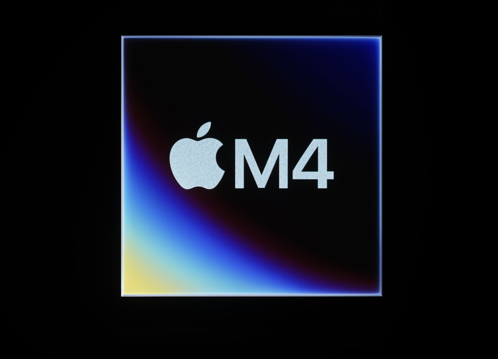

애플의 5월 신제품 발표회에서 가장 혁신적인 변화를 보여준 것은 단연 전문가용 앱의 진화였습니다. 특히 영상 편집 도구 Final Cut Pro와 음악 제작 소프트웨어 Logic Pro는 아이패드 프로의 M4 칩과의 시너지를 통해 모바일 환경에서의 창작 역량을 한층 높였는데요. 단순히 기존 기능의 이식이 아닌, 터치 기반의 모바일 디바이스에 최적화된 형태로 재탄생했다는 점에서 그 의미가 남다릅니다.

과연 Final Cut Pro 2와 Logic Pro 2는 어떤 변화를 담고 있을까요? 지금부터 애플이 선보인 차세대 모바일 크리에이티브 도구의 현재와 미래를 깊이 있게 들여다보도록 하겠습니다.

## Final Cut Pro 2 - 모바일 영상 제작 워크플로우의 빅뱅

Final Cut Pro는 애플의 대표적인 전문가용 비선형 편집 도구(NLE)로, 출시 초기부터 파워풀한 기능과 혁신적인 인터페이스로 많은 영상 제작자들의 사랑을 받아왔습니다. 2011년 파격적인 UI 개편을 단행했던 Final Cut Pro X는 영상 편집의 정석으로 자리 잡았고, 2022년에는 드디어 iPad 버전이 출시되어 모바일 영상 편집의 새 지평을 열기도 했죠.

그리고 이번 Final Cut Pro 2는 그간의 성취를 한 단계 더 진화시킨, 명실상부 최고의 모바일 NLE를 향한 애플의 비전이 응축된 결과물이라 할 수 있습니다.

### M4 칩과의 환상적인 호흡, 극한의 성능을 경험하다

먼저 눈에 띄는 변화는 단연 퍼포먼스의 비약적인 향상입니다. M4 칩과의 최적화를 통해 Final Cut Pro 2는 이전 버전 대비 무려 2배 이상 빨라진 렌더링 속도를 자랑하는데요. 8K 고화질 영상을 편집하거나 다중 효과를 적용할 때도 막힘없이 부드러운 작업이 가능해졌습니다.

이는 단순히 작업 속도의 향상에 그치지 않습니다. 최대 8K 프로레스 RAW나 4K 120fps HDR 영상을 아이패드 하나로 편집할 수 있게 되었다는 건, 그만큼 모바일 환경에서 프로 수준의 결과물을 얻어낼 수 있게 되었음을 의미하기 때문이죠.

이처럼 극한의 성능을 뽑아낼 수 있었던 데에는 M4 칩과 Final Cut Pro 엔진 간의 완벽한 최적화가 숨어 있습니다. 애플은 M4의 강력한 미디어 엔진을 기반으로 Final Cut Pro를 철저히 재설계했다고 하는데요.

H.264, HEVC, ProRes 등 다양한 코덱의 인코딩과 디코딩을 완전히 하드웨어에 위임할 수 있게 된 것은 물론, Neural Engine을 활용한 머신러닝 기반의 자동화 기능도 대폭 강화되었습니다. 클립 분석부터 장면 인식, 자막 생성에 이르기까지 반복적이고 시간 소모적인 작업들을 앱이 스스로 처리해주니 크리에이터는 더욱 창의적인 영역에 집중할 수 있게 되었죠.

### 실시간 협업을 위한 선택이 아닌 필수, Live Multicam

다음으로 주목할 변화는 협업 경험의 혁신입니다. Final Cut Pro 2에서는 Live Multicam 이라는 획기적인 기능이 새롭게 선보였는데요.

Live Multicam은 최대 4대의 iPhone 또는 iPad를 동시에 연결해 멀티 앵글 촬영을 지원하는 기능입니다. 마치 스포츠 중계나 콘서트 실황을 제작하듯 각 카메라의 영상을 실시간으로 모니터링하고 전환할 수 있죠.

메인 디바이스에서는 샷 구도와 설정값을 원격으로 조정할 수 있고, 숏 전환 시점을 실시간으로 선택할 수 있습니다. 촬영이 끝난 영상들은 타임코드 기반으로 완벽히 싱크가 맞춰져 곧바로 멀티캠 편집으로 이어지는데요. 라이브 스위칭 콘솔을 방불케 하는, 모바일 기기에서는 상상하기 어려웠던 혁신적인 경험이 아닐 수 없죠.

### 프로 수준을 넘어선 색보정과 사운드 디자인 도구

Final Cut Pro 2의 또 다른 미덕은 영상과 사운드 전반의 퀄리티를 높일 수 있는 풍부한 도구의 제공입니다. 새로운 HDR 스코프와 브레이크아웃 화면 지원으로 섬세한 색 작업이 가능해졌는데요. 휘도와 채도를 정밀하게 조절할 수 있는 새로운 커브 팔레트, 사용자 정의 LUT Import 기능 등 프로 수준의 색보정 옵션들이 대거 추가되었습니다.

뿐만 아니라 할리우드 영화에서나 볼 법한 영상 룩을 손쉽게 재현할 수 있는 Color Grading 확장팩도 눈에 띕니다. ARRI, RED, Sony 등 주요 시네마 카메라의 색 공간을 커버하는 24종의 룩 템플릿이 기본 제공되는데요. 단 한 번의 클릭으로 영상의 색감과 분위기를 극적으로 변화시킬 수 있죠.

Logic Pro 2와의 시너지도 빼놓을 수 없습니다. 트랙별 역할 자동 지정으로 복잡한 타임라인을 효과적으로 정리할 수 있게 되었고, 다이내믹 이큐나 스테레오 익스팬더 같은 필수 플러그인도 내장되었어요. 스펙트럼 에디터와 사운드 브라우저 기능까지 더해져 영상에 생동감을 불어넣는 사운드 디자인이 그 어느 때보다 쉬워졌습니다.

### 모바일에서 데스크톱까지, 크리에이티브 생태계의 중심에 서다

Final Cut Pro 2의 진면목은 이렇듯 폭발적으로 향상된 성능과 편의성 그 자체에만 있지 않습니다. 오히려 macOS와 iPadOS, 더 나아가 iOS까지 아우르는 애플의 크리에이티브 생태계의 중심에 있다는 데 그 본질이 있어 보이는데요.

macOS와 iPadOS의 Final Cut Pro 2는 단순히 이름만 같은 게 아닙니다. 오히려 거의 동일한 사용자 경험을 제공하면서, 서로의 장점을 최대한 교차 활용하도록 설계되었죠. 예컨대 편집 도중 아이패드에서 Apple Pencil로 섬세한 타임라인 조작을 한 뒤, 작업 내역을 iCloud를 통해 Mac Pro로 싱크하는 식이에요.

거꾸로 데스크톱에서 편집을 시작해 Pro Display XDR의 압도적인 화질로 컬러 그레이딩을 완성한 뒤, 영상을 아이패드로 옮겨와 이동 중에도 편집을 이어갈 수 있죠. 제작자의 창의적 욕구에 발맞춰 자연스럽게 디바이스를 넘나드는 크로스 디바이스 경험, 그것이 Final Cut Pro 2가 지향하는 궁극적 가치입니다.

물론 이는 iOS 기기들과의 연계도 마찬가지입니다. Final Cut Camera라는 전용 앱을 통해 주변의 아이폰과 아이패드를 추가 카메라로 활용할 수 있게 된 것은 물론, 편집이 끝난 영상을 AirPlay로 Apple TV에 직접 스트리밍하는 것까지 말이죠. 덕분에 촬영부터 편집, 색보정, 사운드 믹싱, 그리고 최종 출력에 이르는 전 과정을 애플 생태계 안에서 원스톱으로 처리할 수 있게 되었습니다.

나아가 애플은 Final Cut Pro 2를 중심으로 새로운 영상 제작 커뮤니티의 형성도 독려하고 있습니다. Final Cut Collaboration의 프로젝트 공유 기능을 통해 전 세계 크리에이터들이 자유롭게 소통하고 협력하는 환경을 조성한 것인데요.

작업 과정에서 축적된 노하우와 템플릿, 플러그인 등을 공유하는 것은 물론, 협업 제의나 프로젝트 참여 등도 플랫폼 내에서 자연스럽게 이뤄질 수 있도록 했죠. 다양한 배경의 전문가와 아마추어가 상호 성장해나갈 수 있는 토대를 마련한 셈입니다.

## Logic Pro 2 - 터치와 펜슬로 완성하는 모바일 음악 크리에이션의 신세계

영상 못지않게 혁신의 바람이 거세게 불고 있는 분야가 있습니다. 바로 디지털 음악 제작인데요. 정식 출시된 지 1년 남짓한 iPad 버전의 Logic Pro는 벌써 수많은 뮤지션과 프로듀서들의 필수 앱으로 자리 잡았습니다. 터치와 Apple Pencil을 전면에 내세운 직관적인 인터페이스, 강력한 사운드 엔진, 다양한 가상 악기와 이펙트 등 데스크톱 버전 못지않은 퀄리티의 모바일 DAW를 제공했기 때문이죠.

그리고 이번 Logic Pro 2는 이러한 성과를 한 단계 더 진화시킨 통합 음악 제작 환경을 선보였습니다. 역시 M4 칩의 압도적 성능과 터치 기반의 모바일 최적화 사용자 경험이 핵심을 이루고 있는데요. 지금부터 Logic Pro 2가 그려낼 모바일 음악 크리에이션의 청사진을 깊이 있게 살펴보겠습니다.

### 보다 스마트해진 작곡 & 편곡, AI 시대의 새로운 뮤즈

Logic Pro 2에서 가장 눈에 띄는 변화는 인공지능 기술의 적극적인 도입입니다. 애플은 그동안 쌓아온 방대한 음악 데이터와 머신러닝 알고리즘을 결합해 작곡과 편곡 과정에서 크리에이터를 보조하는 일련의 스마트 도구들을 선보였는데요.

대표적으로는 드럼 트랙 자동 생성 기능으로 유명세를 탄 드러머(Drummer)의 아이디어를 확장한 세션 플레이어(Session Player)를 꼽을 수 있겠습니다. 드럼은 물론 베이스, 기타, 키보드 등 다양한 악기 파트의 반주 패턴을 사용자가 설정한 장르와 무드, 템포에 맞춰 자동으로 생성해주는 도구인데요.

예컨대 R&B 팝 장르의 어반한 느낌, 100BPM 템포에 어울리는 4마디 베이스 라인이 필요하다고 가정해 보겠습니다. 재즈 베이시스트 출신의 세션 플레이어 '줄리안'을 불러와 원하는 느낌의 키워드를 던져주기만 하면, 즉시 몇 가지 멋진 베이스 패턴을 만들어냅니다. 기존에 녹음된 드럼 트랙의 그루브에 싱크를 맞추는 것은 물론, 미묘한 음정과 노트 길이를 사용자 취향에 맞게 변경하는 것도 자유자재고요.

물론 이는 어디까지나 제안일 뿐, 퀄리티에 만족할 때까지 얼마든지 다시 생성하고 고칠 수 있습니다. 그야말로 순식간에 프로 수준의 반주 트랙을 얻을 수 있게 된 셈인데요. 세션 플레이어는 다양한 리듬 악기는 물론, 화성 진행을 담당하는 악기에도 적용 가능해 작곡의 영역까지 크게 확장될 전망입니다.

이 밖에도 음악적 영감을 자극하는 AI 도구들이 대거 추가되었습니다. 멜로디나 코드 진행을 입력하면 그에 어울리는 보컬 멜로디나 신스 라인을 자동으로 생성해주는 기능, 음성 녹음을 분석해 노래의 구조와 박자를 자동으로 검출해주는 기능 등이 대표적이죠.

특히 음원 스템(Stem) 분리 기술의 경우 기존 Logic Pro의 플렉스 타임(Flex Time) 기능과 결합되어 샘플링이나 리믹스 작업에서 엄청난 파급력을 발휘할 것으로 보입니다. 드럼, 베이스, 보컬, 그 외 악기 파트로 멀티트랙을 명확히 분리해내는 것은 AI 기술로 자동화할 수 있는 대표적인 영역이거든요.

물론 이 모든 기능의 근간에는 M4 칩의 놀라운 머신러닝 성능이 자리하고 있습니다. 16코어 Neural Engine은 로컬 기기에서 복잡한 AI 알고리즘을 구동하기에 충분한 연산력을 제공하죠. 덕분에 Logic Pro 2의 미래지향적 음악 제작 경험은 클라우드에 의존하지 않고도 언제 어디서나 빠르고 안정적으로 구현될 수 있게 되었습니다.

### 터치와 펜슬로 연주하고 오케스트레이션하는 즐거움

AI 기술의 접목과 함께 Logic Pro 2를 관통하는 또 다른 화두는 '터치'입니다. 애플은 태생적으로 터치 인터페이스에 최적화된 모바일 DAW를 표방하며, 뮤지션들의 직관과 표현력을 극대화하는 혁신적 입력 방식을 다수 선보였는데요.

우선 눈에 띄는 변화는 각종 가상 악기의 연주 방식에서 찾아볼 수 있습니다. 건반이나 기타, 드럼 등 실제 악기의 연주감을 터치로 완벽히 재현하는 것이 목표인데요. 단순히 화면을 누르는 것 이상으로, 속도와 압력, 움직임의 방향까지 감지해 풍부한 표현력을 끌어내는 것이 핵심입니다.

피아노를 예로 들어 보겠습니다. 터치 건반을 누르는 속도에 따라 섬세한 벨로시티를 조절할 수 있고, 눌러 줌과 동시에 옆으로 살짝 미끄러뜨리면 피치를 굴절시키는 것도 가능해요. 나아가 건반에서 손가락을 뗄 때 위쪽으로 빠르게 끌어당기는 제스처를 취하면, 흔히 '키 릴리스'라 부르는 잔향까지 섬세하게 조절할 수 있죠.

기타도 마찬가지입니다. 單線 상의 터치 프렛보드에서 왼손 비브라토는 물론, 오른손 픽킹과 스트러밍까지 사실적으로 연주할 수 있어요. 코드 진행에 맞춰 자동으로 갈아끼워지는 기타 셰이프도 인상적입니다. 게다가 기타 바디를 터치하면서 피킹 강도를 실시간으로 조절하는 것도 가능하죠.

드럼의 경우 루프 프레이즈를 손쉽게 제작할 수 있는 스텝 시퀀서 방식의 드럼 머신을 새롭게 탑재했는데요. 화면상의 드럼 패드를 직접 두드려 나만의 비트를 만들 수 있습니다. 터치 강도에 따라 샘플 트리거의 다이내믹스가 실시간으로 변화하는 것은 물론, 드래그 앤 드롭으로 비트 배치를 손쉽게 편집할 수도 있죠.

이처럼 Logic Pro 2는 다양한 사실적 터치 인터페이스를 통해 뮤지션들의 손끝에서 음악이 직접 탄생하는 경험을 제공하고 있습니다. 특히 단순한 2D 그래픽을 넘어, 입체적인 질감과 물성을 섬세하게 묘사하는 skeuomorphic 디자인의 적극적 도입이 돋보이는데요. 마치 실제 악기를 만지듯 손으로 주무르고 퉁기며 소리를 만들어내는 감각은 정말 획기적이라 하지 않을 수 없어요.

Apple Pencil의 존재감도 크게 높아졌습니다. 피아노 롤 상에서 Pencil로 직접 노트를 그려 넣을 수 있게 되었거든요. 섬세한 압력 감지로 벨로시티는 물론, 피치 밴드와 모듈레이션까지 Pencil의 기울기로 조절하는 게 가능해요. 오선지에 악보를 필기하듯 멜로디를 스케치하고 수정해 나가는 작곡 과정은 그야말로 음악가의 오랜 꿈을 실현해주는 혁신이 아닐 수 없죠.

이는 오케스트레이션 작업에서도 위력을 발휘합니다. 풍부한 사운드 라이브러리를 기반으로 한 가상 오케스트라는 이제 터치와 Pencil로 지휘할 수 있게 되었거든요. 각 파트의 밸런스와 움직임, 셈여림을 Multi-Touch로 조절하고, Pencil로는 크레셴도와 디크레셴도의 자연스러운 굴곡을 그려 넣습니다.
마치 종이 위에 파도를 그리듯 오케스트라의 다이내믹스를 형상화하는 감각은 정말 경이롭기까지 한데요. 그 결과 훨씬 입체적이고 표현력 풍부한 편곡이 가능해졌습니다.

## 결론 : 모두를 위한 창작의 시대를 열다

Final Cut Pro 2와 Logic Pro 2는 애플이 선보인 차세대 모바일 크리에이티브 플랫폼의 현재이자 미래입니다. 이는 단순히 기존 기능의 모바일 이식이 아닌, 포스트 PC 시대 콘텐츠 제작 환경의 새로운 패러다임을 제시하는 혁신이었습니다.

최첨단 영상 편집과 음악 프로덕션 도구를 대중화된 모바일 기기에 최적화된 형태로 구현해냈다는 것, 그것이 Final Cut Pro 2와 Logic Pro 2의 본질이자 가치입니다. 여기에는 M4로 대표되는 애플 실리콘의 비약적 성능 향상과 더불어, 다양한 기기 간 끊김없는 크로스 플랫폼 통합 경험을 제공하려는 애플의 비전이 투영되어 있습니다.

무엇보다 이들의 등장은 창의성의 민주화를 향한 일대 전환점이 될 것입니다. 이제 누구나 주머니 속 아이패드 하나로 자신만의 콘텐츠를 제작해 세상과 공유할 수 있게 되었으니까요. 영상과 음악을 매개로 개성을 표현하고 인정받는 과정은 모두에게 자아실현의 새 지평을 열어줄 잠재력을 지니고 있습니다.

물론 이는 시작에 불과할 것입니다. AR과 VR, AI 등 첨단 기술의 진화는 창작 영역을 더욱 확장시키고, 누구라도 원하는 바를 자유롭게 표현할 수 있는 환경으로 우리를 인도할 테니까요. Final Cut Pro 2와 Logic Pro 2는 그런 의미에서 포스트 모바일 크리에이티브 혁명의 서막을 여는 신호탄이라 할 만합니다.

애플은 이를 통해 테크 혁신이 개인의 창의성을 꽃피우고, 그렇게 발현된 창의성이 다시 새로운 혁신의 원동력이 되는 선순환 구조를 제시하고 있습니다. Final Cut Pro 2, Logic Pro 2로 열린 모두를 위한 창작의 시대, 그 희망찬 비전은 이제 우리 모두의 것이 되었습니다. 애플과 함께 그려갈 크리에이티브의 新 지평을 향한 여정, 우리 모두 주목해야 할 때입니다.
