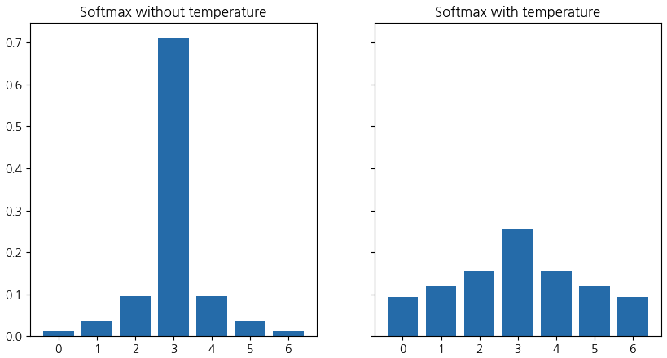
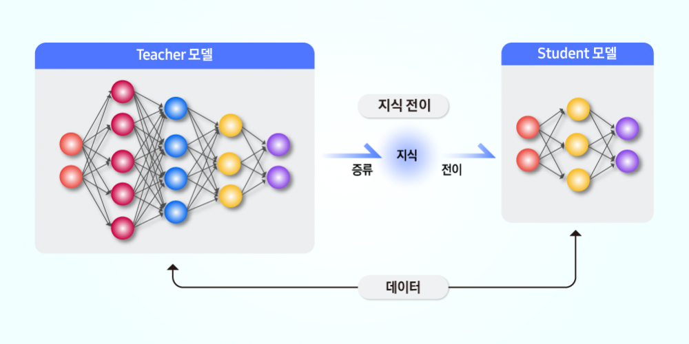
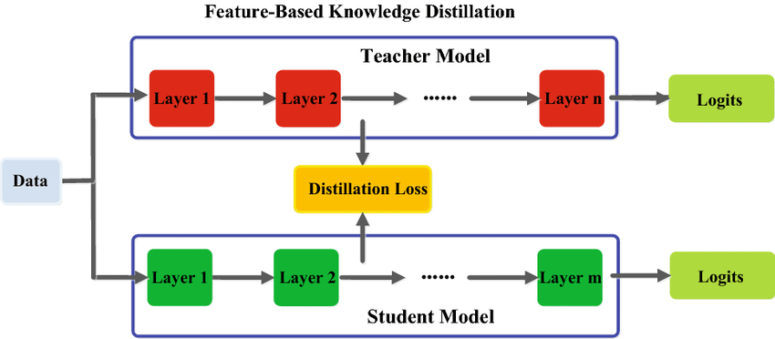

# 지식 증류( Knowledge Distillation )

## **1. 서론**  

딥러닝 모델이 점점 더 커지고 복잡해지면서 높은 정확도를 달성하는 것은 쉬워졌지만, 그만큼 연산량과 메모리 사용량도 급증하고 있다. 이러한 초거대 모델을 모바일 기기나 엣지 디바이스에서 직접 사용할 수 없는 경우가 많아졌고, 이 문제를 해결하기 위한 방법 중 하나가 바로 **지식 증류( Knowledge Distillation )** 다.  

지식 증류는 **대형 모델(Teacher)의 지식을 작은 모델(Student)로 압축하여 전이**하는 기법이다. 단순히 모델의 크기를 줄이는 것이 아니라, Teacher가 학습한 패턴과 분포까지 Student가 학습할 수 있도록 설계된다. 따라서 같은 크기의 모델을 직접 학습하는 것보다 지식 증류를 통해 학습한 Student 모델이 훨씬 더 높은 성능을 보이는 경우가 많다.  

예를 들어, 원래 100층짜리 ResNet(Teacher)이 있다면, 이를 18층짜리 ResNet(Student)로 압축하면서도 최대한 Teacher의 성능을 유지하도록 만드는 것이 지식 증류의 목표다. 자연어 처리에서도 BERT-Large 같은 거대한 모델을 DistilBERT 같은 소형 모델로 변환하는 과정에서 지식 증류가 핵심적인 역할을 한다.  

---

## **2. 지식 증류의 핵심 개념**  

기존의 모델 학습 방식에서는 Hard Label(즉, 정답 레이블만 1이고 나머지는 0인 형태)을 기반으로 학습이 이루어진다. 하지만 지식 증류에서는 Hard Label뿐만 아니라 **Teacher 모델이 예측한 Soft Target(확률 분포)을 함께 사용**한다.  

예를 들어, 강아지, 고양이, 자동차를 분류하는 모델이 있다고 하자. 일반적인 지도 학습에서는 정답이 '강아지'라면 [1, 0, 0]의 형태로 학습된다. 그러나 Teacher 모델의 Softmax 출력을 보면 강아지(0.85), 고양이(0.12), 자동차(0.03)처럼 확률값이 부드럽게 분포하는 경우가 많다.  

이러한 Soft Target을 활용하면 Student 모델은 단순히 '강아지'만 학습하는 것이 아니라, '강아지'와 '고양이'가 유사한 특징을 공유하고 있다는 것까지 학습할 수 있다. 이렇게 하면 Student 모델이 더 일반화된 분포를 학습할 수 있어, Hard Label만 사용할 때보다 성능이 향상된다.  

여기서 중요한 개념이 **Softmax의 온도 매개변수(Temperature, T)** 이다. Softmax 함수에서 $$T$$를 증가시키면 확률 분포가 더 부드러워지고, $$T$$를 낮추면 더 날카로운 예측을 하게 된다. 보통 지식 증류에서는 $$T=2$$~$$5$$ 정도를 사용해 Teacher의 예측이 더 풍부한 정보를 담도록 만든다.  

---

## **3. 지식 증류의 학습 과정**  

지식 증류를 적용하려면 먼저 Teacher 모델을 학습시켜야 한다. 일반적으로 큰 데이터셋에서 높은 성능을 내는 Teacher 모델을 학습한 후, 이를 활용해 Student 모델을 학습하는 방식이다.  

Student 모델은 Hard Label뿐만 아니라 Teacher 모델의 Soft Target도 함께 참고하면서 학습한다. 이 과정에서 손실 함수는 두 가지 요소로 구성된다. 첫 번째는 Student의 예측과 정답 간의 차이를 최소화하는 일반적인 **Cross-Entropy 손실**이다. 두 번째는 Student의 Softmax 출력과 Teacher의 Softmax 출력 간의 차이를 최소화하는 **Kullback-Leibler(KL) Divergence 손실**이다.  

쉽게 말해, **Student 모델은 정답을 맞추는 것뿐만 아니라, Teacher 모델이 어떻게 예측하는지도 학습해야 한다.** 이를 통해 Student는 단순한 모델 축소가 아니라, Teacher가 가진 분포적인 특성까지 습득할 수 있다.  

지식 증류에서 중요한 하이퍼파라미터는 정답과 Soft Target 간의 손실을 얼마나 가중치를 줄 것인가를 결정하는 $$\alpha$$ 값이다. 일반적으로 $$\alpha$$는 0.5~0.9 범위에서 조절되며, Soft Target을 더 많이 활용할수록 모델의 일반화 성능이 높아지는 경향이 있다.  

---

## **4. 지식 증류의 변형 및 확장**  

지식 증류는 단순히 로짓 값(Softmax 출력)을 사용하는 것뿐만 아니라, 다양한 형태로 확장될 수 있다.  

첫 번째로 **Feature-based Distillation** 기법이 있다. 이는 Teacher 모델의 최종 출력뿐만 아니라 **중간 레이어의 Feature Map을 Student가 모방하도록 학습**하는 방식이다. 예를 들어, ResNet-50의 특정 레이어에서 추출한 Feature를 ResNet-18이 따라 하도록 만들면, 단순히 출력 값만 모방하는 것보다 더 풍부한 표현을 학습할 수 있다.  

두 번째로 **Attention Transfer** 방식이 있다. 이는 Teacher 모델이 입력 데이터에서 **어떤 부분을 집중해서 보는지(Attention Map)를 Student가 모방**하도록 하는 방식이다. 이미지 분류 모델에서는 Teacher가 주목하는 부분을 Student도 비슷하게 따라 하게 되므로, 모델의 시각적 주의 집중 능력이 향상된다.  

세 번째로 **Relational Knowledge Distillation**이라는 개념이 있다. 기존의 증류 방식이 개별 데이터 포인트의 Feature를 모방하는 데 초점을 맞췄다면, 이 방법은 **샘플 간의 관계(예: 두 개의 이미지가 얼마나 유사한지)를 유지하도록 Student를 학습**시키는 방식이다. 예를 들어, Teacher 모델이 개와 늑대를 가까운 Feature로 인식했다면, Student도 이 관계성을 유지하면서 학습하도록 만든다. 이를 통해 데이터 구조 자체를 보존할 수 있다.  

마지막으로 **Self-Distillation** 개념도 있다. 일반적인 지식 증류는 Teacher와 Student가 별개의 모델이지만, Self-Distillation에서는 같은 모델 구조를 Teacher로 사용한다. 즉, 먼저 학습된 모델을 Teacher로 삼아 다시 학습을 진행하는 방식이다. 이를 통해 동일한 모델이라도 더 깊이 학습할 수 있는 효과가 있다.  

---

## **관련 연구**  

지식 증류는 모델 압축 및 최적화 연구에서 매우 중요한 기법으로 자리 잡았으며, 여러 변형 방법들이 제안되었다.  

2015년, Geoffrey Hinton이 발표한 *"Distilling the Knowledge in a Neural Network"* 논문은 이 개념을 처음으로 공식화했다. 그는 Soft Target을 활용하여 Student 모델이 Teacher의 지식을 효과적으로 학습할 수 있음을 보여주었고, Softmax 온도를 조절하는 기법을 도입했다.  

이후 **Romero et al. (2015)**는 *"FitNets: Hints for Thin Deep Nets"* 논문을 통해 Feature-based Distillation 개념을 도입하며, 중간 레이어의 정보를 활용하는 방식이 단순 출력 값 증류보다 효과적임을 증명했다.  

2017년에는 **Zagoruyko & Komodakis**가 *"Paying More Attention to Attention"* 논문에서 Attention Transfer 기법을 소개하며, Teacher 모델이 주목하는 영역을 Student가 학습하는 것이 효과적이라는 점을 강조했다.  

2019년 **Park et al.**의 *"Relational Knowledge Distillation"* 논문에서는 단순히 Feature를 모방하는 것이 아니라, 데이터 간의 관계성을 유지하는 것이 중요하다는 점을 실험적으로 입증했다.  

또한, **Furlanello et al. (2018)**의 *"Born-Again Neural Networks"* 논문에서는 Self-Distillation 개념을 소개하며, 동일한 모델 구조에서도 반복적인 증류를 통해 성능을 향상시킬 수 있음을 보여주었다.  

이처럼 지식 증류는 단순한 모델 압축 기법을 넘어, **딥러닝 모델이 학습한 지식을 효과적으로 전이하는 핵심적인 기술**로 발전하고 있으며, 앞으로도 다양한 연구가 지속될 것으로 예상된다.