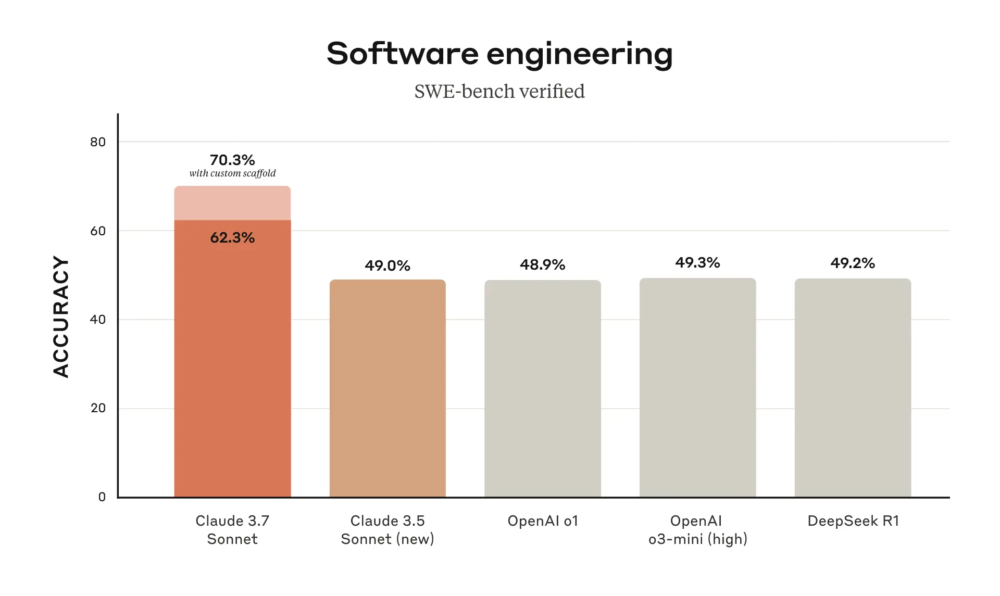

AI는 이제 단순한 대화형 도구를 넘어 **실제 업무와 개발을 보조하는 수준**으로 발전하고 있다. 하지만 기존 AI 모델들은 여전히 몇 가지 한계를 가지고 있었다.  
- 답변이 너무 단순하거나 깊이가 부족하다.
- 개발자들이 실제로 쓰기에 부족한 코드만 생성한다.
- 보안성과 신뢰성 문제가 해결되지 않았다.

Anthropic의 **Claude 3.7 Sonnet**은 이런 한계를 뛰어넘기 위해 등장했다. **즉각적인 응답과 심층적 사고를 동시에 지원하는 하이브리드 추론**, AI가 직접 코드를 읽고 수정하는 **Claude Code**, 그리고 **비용 대비 성능 최적화**까지, 실전에서 활용하기 좋은 AI 모델로 진화했다.  

그렇다면, Claude 3.7 Sonnet이 실제로 어떤 점에서 더 강력해졌는지 깊이 있게 살펴보자.  

---

## **1. 하이브리드 추론: 더 빠르고 똑똑하게 사고하는 AI**  

기존 AI 모델들은 크게 두 가지 유형으로 나뉘었다.  
1. **빠른 답변을 제공하는 모델** → 즉각적인 응답을 하지만 깊이가 부족하다.  
2. **심층적인 사고를 하는 모델** → 답변의 품질이 높지만, 응답 속도가 느려진다.  

Claude 3.7 Sonnet은 이 두 가지 방식을 **하나의 모델에서 자유롭게 조절할 수 있도록 개선**했다.  

### **① 즉각적인 답변 모드 (Standard Mode)**  
기존 Claude 3.5 Sonnet보다 속도가 더 빨라졌으며, **일반적인 질문이나 짧은 코드 생성 요청에 빠르게 응답**한다.  
- 챗봇과의 대화, 정보 검색, 요약, 간단한 코드 생성 등에 적합하다.  
- 빠른 질문에도 더 정교한 답변을 제공하도록 최적화되었다.  

### **② 확장 사고 모드 (Extended Thinking Mode)**  
이 모드에서는 Claude가 단순히 답변을 생성하는 것이 아니라, **자기반성(self-reflection)을 통해 스스로 답변을 검토하고 수정**한다.  
- 수학 문제, 논리 퍼즐, 복잡한 코딩 질문, 법률 분석 등에 적합하다.  
- Claude가 여러 번 답변을 수정하면서 **더 정확하고 깊이 있는 답변**을 도출한다.  

#### **자기반성(self-reflection) 기능은 어떻게 작동할까?**  
1. **Claude가 최초 답변을 생성한다.**  
2. **스스로 답변을 검토하고, 논리적 오류나 부족한 부분을 분석한다.**  
3. **필요하면 답변을 수정하고 최종적으로 더 나은 답변을 제공한다.**  

이 과정은 마치 인간이 **문제를 풀고, 스스로 검토하고, 다시 답변을 개선하는 과정과 유사**하다.  

#### **API 사용자들에게 주어진 새로운 기능: ‘생각하는 토큰 개수 조절’**  
- API를 통해 Claude 3.7 Sonnet을 사용하는 경우, **얼마나 깊이 사고할 것인지 직접 조절 가능**하다.  
- `N`개의 토큰을 설정하여 Claude가 생각하는 시간을 조절할 수 있으며, 최대 128K 토큰까지 확장 가능하다.  
- 즉, 기업 사용자는 **빠른 답변이 필요한 경우 속도를 우선시하고, 높은 품질의 답변이 필요한 경우 심층 사고를 활성화하는 방식으로 조정**할 수 있다.  

### **③ 실제 벤치마크 성능**

Claude 3.7 Sonnet은 다양한 벤치마크에서 **기존 AI 모델들을 능가하는 성과**를 보였다. 특히 **SWE-bench Verified, TAU-bench, MATH 벤치마크**에서 최고 성능을 기록하며 실전 활용 가능성을 증명했다.  

#### **1) SWE-bench Verified – 실전 소프트웨어 문제 해결 능력**  
SWE-bench Verified는 **AI가 실제 오픈소스 프로젝트에서 발생하는 버그를 수정할 수 있는지 평가하는 벤치마크**다. 기존 AI 모델들은 단순한 코드 수정은 가능했지만, 프로젝트 전반의 문맥을 이해하고 정교한 버그 수정을 수행하는 데 한계가 있었다.  

**Claude 3.7 Sonnet은 SWE-bench Verified에서 기존 AI 모델을 뛰어넘는 최고 성능을 기록했다.**  
- 기존 AI는 단순히 코드 스니펫을 수정하는 데 그쳤지만, Claude 3.7 Sonnet은 **프로젝트 전체 구조를 파악하고 적절한 수정안을 제시하는 능력을 보여줬다**.  
- 특히 **확장 사고 모드(Extended Thinking Mode)** 를 활성화하면 코드 수정 정확도가 더욱 향상되었다.  

---

#### **2) TAU-bench – 복잡한 작업에서의 추론 및 문제 해결 능력**  
TAU-bench는 AI 모델이 실제 현실에서 발생하는 **복잡한 문제를 해결하고, 인간과 협업하며, 도구를 효과적으로 사용할 수 있는지 평가하는 벤치마크**다. Claude 3.7 Sonnet은 TAU-bench에서도 최고 수준의 성능을 보이며 **도구 활용 능력 및 복합적 추론 능력에서 강점을 보였다.**  

이 벤치마크에서 Claude 3.7 Sonnet은 특히 **멀티 스텝 추론(multi-step reasoning)** 과 **자기반성(self-reflection) 기능**을 활용해 **도구를 능숙하게 사용하며 문제를 해결**하는 능력을 보여줬다.  

#### **3) 벤치마크**

Claude 3.7 Sonnet은 DeepSeek R1 이나 OpenAI 의 최신 모델과 비교해도 손색없는 모습을 보여줬다. 또한, 개인적인 견해로 가장 인간의 요구사항을 잘 들어주고, 코딩에 최적화된 모델이라고 생각한다.

초기 테스트 결과, **Claude 3.7 Sonnet이 코딩 역량에서 확실한 리더십을 발휘**하는 것으로 나타났다.  

- **Cursor**는 Claude가 **복잡한 코드베이스를 처리하고 고급 개발 도구를 활용하는 능력이 크게 향상되었으며**, 실전 코딩 작업에서 **다시 한 번 동급 최고 수준의 성능을 보였다고 평가**했다.  
- **Cognition**은 Claude가 **코드 변경을 계획하고 전체 스택 업데이트를 수행하는 능력에서 다른 모델을 압도했다**고 분석했다.  
- **Vercel**은 Claude의 **정밀한 추론 능력이 복잡한 에이전트 워크플로 처리에 강점을 보인다**고 강조했다.  
- **Replit**은 Claude를 활용해 **다른 AI 모델들이 해결하지 못한 부분을 보완하며, 정교한 웹 애플리케이션과 대시보드를 처음부터 성공적으로 구축했다**고 밝혔다.  
- **Canva**의 테스트에서는 Claude가 **탁월한 디자인 감각을 반영하면서도 오류율을 크게 줄여, 프로덕션 환경에서 바로 사용할 수 있는 수준의 코드를 꾸준히 생성**하는 것으로 나타났다.  

이러한 평가들은 단순한 코드 생성이 아니라, **실제 개발 환경에서 AI가 얼마나 효과적으로 협업할 수 있는지**를 보여주는 중요한 지표다.

---

## **2. Claude Code: AI가 단순히 코드를 생성하는 것이 아니라, 코드를 직접 관리한다**  

기존의 AI 코딩 도구들은 **단순히 코드를 생성하는 것에 그쳤다**. 하지만 개발자들은 단순한 코드 생성만으로는 충분하지 않다.  
- 코드가 **기존 프로젝트와 호환**되어야 한다.  
- 생성된 코드가 **실제 실행 가능한 코드인지 검증**되어야 한다.  
- 코드가 프로젝트 전체에서 **일관성을 유지**해야 한다.  

Claude 3.7 Sonnet은 이런 한계를 극복하기 위해 **Claude Code**라는 새로운 기능을 도입했다.  

### **① Claude Code는 단순한 코드 생성기가 아니다.**  
Claude Code는 단순히 새 코드를 생성하는 것이 아니라, **기존 코드베이스를 읽고 이해한 후 적절한 코드 변경을 수행**한다.  

#### **Claude Code의 핵심 기능**  
- **기존 코드 분석 및 리팩토링**: 프로젝트 전체를 분석하고, 기존 코드에 맞게 최적화된 변경을 제안한다.  
- **파일 수정 및 테스트 코드 작성**: 코드 생성뿐만 아니라, 직접 파일을 편집하고 테스트 코드까지 생성한다.  
- **GitHub과 연동**: AI가 코드를 직접 커밋하고 푸시할 수 있어, 개발자와 AI가 협업하는 환경을 조성한다.  
- **터미널 명령 실행**: Claude Code는 CLI(명령줄 인터페이스)에서 직접 명령을 실행하며, 코드를 테스트하고 디버깅할 수 있다.  

### **② 기존 AI 코딩 도구들과 차별화되는 기술적 특징**  
Claude Code는 **멀티 모달 추론(multi-modal reasoning)과 툴 사용 능력(tool use capabilities)**을 결합하여 개발자의 업무를 실질적으로 지원한다.  
- **멀티 모달 추론**: 코드뿐만 아니라 **관련 문서, API 설명서, 에러 로그까지 분석**하여 문제를 해결할 수 있다.  
- **툴 사용 능력**: Claude Code는 단순한 코드 생성이 아니라, **코드를 실행하고 결과를 분석하여 수정하는 능력**을 갖췄다.  

실제 테스트 결과, **Claude Code를 활용하면 기존에 45분 이상 걸리던 코드 수정 작업을 한 번에 끝낼 수 있다**는 평가가 나오고 있다.  

---

## **3. 비용은 그대로, 성능은 대폭 향상**  

AI 성능이 향상되었다고 해서 비용이 증가하면 실전에서 사용하기 어렵다. 다행히, Claude 3.7 Sonnet은 **가격을 기존과 동일하게 유지하면서도 성능을 대폭 개선**했다.  

- **입력 토큰:** $3 / 백만 토큰  
- **출력 토큰:** $15 / 백만 토큰 (추론 과정 포함)  
- **최대 128K 토큰 지원** (한 번의 요청으로 더 많은 컨텍스트를 처리 가능)  

기존 Claude 3.5 Sonnet과 동일한 비용으로 사용할 수 있기 때문에, 기업 사용자들에게도 부담이 없다.  

---

## **4. 보안과 신뢰성 강화 – AI가 실무에 적용되기 위해 필요한 변화**  

### **① 프롬프트 인젝션 공격 방어 강화**  
Claude 3.7 Sonnet은 프롬프트 인젝션(prompt injection) 공격을 탐지하고 차단하는 능력이 대폭 향상되었다.  

### **② 불필요한 거부율 45% 감소**  
기존 AI 모델들은 안전을 이유로 지나치게 많은 질문을 거부하는 경향이 있었다. Claude 3.7 Sonnet은 **불필요한 거부율을 45% 줄여**, 더 유연한 답변을 제공할 수 있도록 개선되었다.  

### **③ AI의 추론 과정이 더 투명해짐**  
Claude 3.7 Sonnet은 단순히 답변을 제공하는 것이 아니라, **왜 그런 답변을 도출했는지 설명하는 능력**이 강화되었다.  

---

## **5. 앞으로 Claude 의 미래**  

### **AI와 인간의 협업, 그 다음 단계는?**  

Claude 3.7 Sonnet과 Claude Code는 단순한 AI 모델의 발전을 넘어, **인간의 역량을 실질적으로 확장하는 중요한 전환점**을 보여준다.  

이제 AI는 단순히 질문에 답하거나 코드를 생성하는 수준을 넘어, **깊이 있는 추론을 수행하고, 자율적으로 작업을 처리하며, 인간과 효과적으로 협업하는 단계로 진화하고 있다.**  

Anthropic이 제시한 Claude의 로드맵을 살펴보면, Claude는 단순한 보조 역할에서 시작해, 궁극적으로 **인류가 해결하기 어려운 문제를 돌파하는 AI**로 발전할 것으로 보인다.  

1. **2024년 – Claude assists**  
   - 사용자가 현재 하고 있는 작업을 더 효과적으로 수행할 수 있도록 돕는다.  
   - AI가 인간의 생산성을 높이고, 업무의 질을 향상시키는 역할을 수행.  

2. **2025년 – Claude collaborates**  
   - AI가 단순한 도우미를 넘어, **전문가 수준의 독립적인 작업을 수행**한다.  
   - 개인과 팀이 할 수 있는 일의 범위를 확장하고, 더 창의적인 협업을 가능하게 한다.  

3. **2027년 – Claude pioneers**  
   - 기존에는 수년이 걸릴 문제를 AI가 **혁신적으로 해결하는 단계**에 도달.  
   - 인간의 능력을 단순히 보조하는 것이 아니라, **AI와 함께 전례 없는 문제 해결을 이루는 미래**를 실현.  

이제 AI는 더 이상 보조적인 역할에 머무르지 않는다. **Claude 3.7 Sonnet과 Claude Code는 AI가 인간과 함께 혁신을 만들어가는 새로운 시대의 시작을 알리고 있다.**

## **결론: 실전에서 가장 강력한 AI, Claude 3.7 Sonnet**  

Claude 3.7 Sonnet은 단순한 업그레이드가 아니다.  
- **더 빠르고 정교한 하이브리드 추론**으로 즉각적인 응답과 심층 사고를 동시에 지원  
- **개발자를 위한 Claude Code** 도입으로 AI가 직접 코드를 읽고 수정하는 수준으로 발전  
- **비용은 유지하면서도 성능이 대폭 향상**  
- **보안과 신뢰성 강화로 실무 적용 가능성이 커짐**  

이제 AI는 단순한 도구를 넘어, **실제 업무를 함께 수행하는 파트너**가 되고 있다.