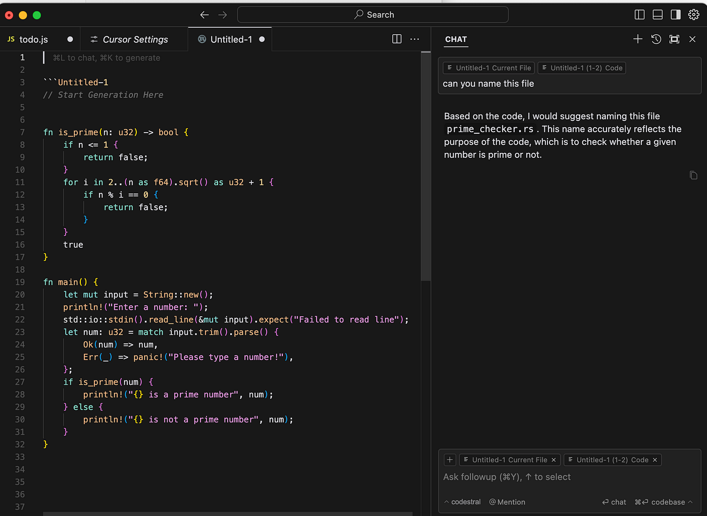
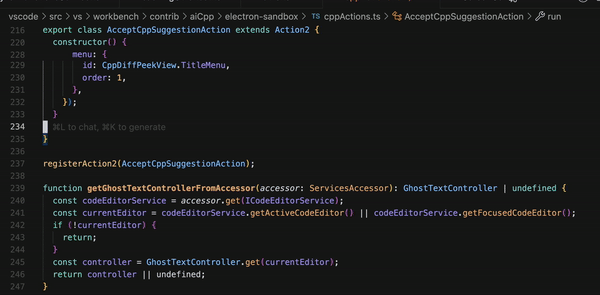
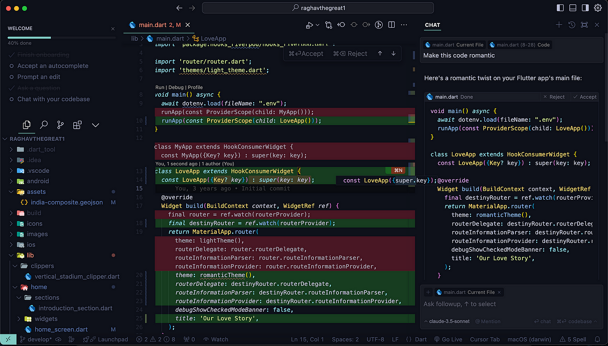

개발자라면 한 번쯤 ‘자동 완성’이 제공하는 한계를 느껴본 적이 있을 겁니다. 짧은 구문 완성을 넘어 프로젝트 전반을 이해하고, 복잡한 리팩토링을 자연어로 지시하며, 멀티 파일에 걸친 코드를 한 번에 생성해주는 도구는 그간 드물었죠. Cursor는 이러한 요구를 충족시키기 위해 설계된 AI 통합 개발 환경으로, 단순 플러그인이 아닌 독립 실행형 IDE로서의 장점을 갖추고 있습니다.

## 손쉬운 설치와 친숙한 인터페이스

Cursor는 Visual Studio Code를 포크한 형태로 개발되어, 기존 VS Code 사용자가 이식 없이 곧바로 적응할 수 있다는 강점을 가집니다. Windows, macOS, Linux용 네이티브 패키지를 공식 사이트에서 내려받아 설치하면, 예전 확장 기능과 테마, 키 바인딩을 한 번에 가져올 수 있어 초기 설정이 거의 필요 없습니다.

## ‘Tab, Tab, Tab’으로 구현하는 다중 라인 자동 완성

기존 자동 완성이 단일 토큰 제안에 머물렀다면, Cursor의 ‘Tab’ 기능은 다릅니다. 커서를 놓고 탭 키를 누르면, AI가 프로젝트 전체 컨텍스트를 분석해 수 줄에 걸친 코드를 한 번에 완성해줍니다. 2025년 1월 발표된 ‘Fusion’ 모델을 통해 제안 정확도와 속도 모두 크게 향상되었는데, 평균 대기 시간이 475ms에서 260ms로 줄고, 보다 긴 코드 블록을 10배 이상 제안할 수 있게 되었습니다.

## 멀티 파일 코드 생성과 직관적인 Diff 뷰

Cursor는 단일 파일을 넘어 여러 파일에 걸친 코드를 한 번에 생성하거나 업데이트할 수 있는 ‘Composer’ 기능을 제공합니다. 예를 들어, 새로운 API 엔드포인트를 추가하면서 관련 테스트 케이스와 문서 주석까지 한 번에 생성하는 워크플로우가 가능합니다. 변경 사항은 내장된 Diff 뷰어로 즉시 확인할 수 있어, 생산성을 높이면서도 코드 품질을 놓치지 않습니다.

## 자연어 편집을 통한 직관적 코드 리팩토링

에디터 내 채팅 창(Ctrl+K)을 열고 “이 함수에 예외 처리를 추가해줘”라고 입력하면, Cursor가 해당 위치를 찾아 `try…catch` 블록을 추가하고, 일관된 코드 스타일로 테스트 코드까지 자동 생성해줍니다. 단순 명령을 넘어, 팀의 네이밍 컨벤션과 포맷팅 가이드도 유지되도록 학습되어 있어, 대규모 리팩토링 작업에서도 일관성을 잃지 않습니다.

## 전체 코드베이스 인덱싱 및 자연어 질의

Cursor는 프로젝트 내 모든 파일을 실시간으로 인덱싱하여, “UserService에서 `getUserById`가 호출되는 곳을 보여줘” 같은 질문 한 줄만으로 관련 위치를 즉시 찾아줍니다. 문서화가 미흡한 레거시 프로젝트에서도 클릭 몇 번으로 필요한 정보를 얻을 수 있어, 탐색에 소요되는 시간을 획기적으로 줄여줍니다.

## 하이브리드 에이전트 모드와 다양한 모델 지원

Cursor는 o4-mini, Claude 3.7 Sonnet, 자체 경량 모델 등 여러 백엔드를 지원하며, 간단한 자동 완성은 로컬 모델로 즉시 처리하고, 복잡한 요청은 클라우드 모델로 전환하는 하이브리드 방식을 채택했습니다. 이를 통해 지연 시간을 최소화하면서도 복잡도 높은 작업에서 높은 완성도를 유지합니다.

## VS Code 확장성 그대로, 리소스 사용 최적화

Cursor는 VS Code 생태계와 호환되도록 설계되어, 기존에 쓰던 디버거·린터·테마·단축키를 그대로 활용할 수 있습니다. 또한 ‘Fusion’ 모델 도입 후 Tab 제안이 대폭 빨라져, 고사양 머신이 아니어도 쾌적한 편집 경험을 제공합니다.

## 실무에서 더 똑똑하게 활용하는 팁

* **프롬프트 구체화**: “로그 추가” 대신 “UserController의 `getUser` 시작 부분에 userId와 timestamp 로깅해줘”처럼 구체적으로 지시하면 AI가 더 정확한 코드를 생성합니다.
* **채팅 세션 유지**: 한 세션에서 이어지는 대화는 이전 요청을 기억해 더 자연스러운 연속 제안이 가능합니다.
* **단축키 숙지**: Tab 자동 완성 외에도 Ctrl+L(챗 패널), Ctrl+I(멀티 파일 생성) 등을 익히면 워크플로우가 한층 빨라집니다.
* **스타일 가이드 통합**: 팀의 코드 스타일 문서를 AI에게 학습시켜 일관된 자동 완성 결과를 얻을 수 있습니다.