**첨부 PDF**: [초전도 및 이온 트랩 양자 프로세서의 2 큐비트 분포 정확도 비교](<./초전도 및 이온 트랩 양자 프로세서의 2 큐비트 분포 정확도 비교.pdf>)

연구를 시작할 때 목표는 단순했습니다. 두 개의 큐비트로 구성된 가장 기본적인 얽힘 상태, 벨(Bell) 상태를 서로 다른 하드웨어에서 같은 논리로 구현했을 때 실제 측정 분포가 얼마나 일치하는지 확인하는 것. 실험 환경은 두 갈래로 나뉘었습니다. 이온 트랩 계열은 AWS Braket을 통해 IonQ 디바이스를 사용했고, 초전도 큐비트 계열은 IBM Quantum의 `IBM Brisbane`과 `IBM Torino`를 선택했습니다. 제어 스택과 큐비트 물리 특성이 완전히 다르기 때문에, 동일한 회로라도 잡음과 보정의 결과는 다르게 나타납니다. 그 차이를 온전히 데이터로 확인해보는 것이 이번 글의 목적이었습니다.

실험 플로우는 간결합니다. 회로는 모두 같고, 준비(prepare)–얽힘(entangle)–측정(measure)의 정석을 따릅니다. 먼저 첫 번째 큐비트에 아다마르(H) 게이트를 적용하고, 두 번째 큐비트에 대해 CNOT으로 얽힘을 생성합니다. 이상적인 경우라면 측정 분포는 |00⟩과 |11⟩에 50:50으로 집중되어야 합니다. 이후 플랫폼별 잡음 채널과 보정(calibration) 상태가 결과를 얼마나 왜곡하는지가 관찰 포인트가 됩니다.

## 실행 환경과 대시보드

아래 스크린샷은 실제 실험 당시의 제출/큐 상태를 보여줍니다. 큐 대기 시간과 디바이스 캘리브레이션 타임스탬프는 결과 해석에서 중요하게 작용했기에 함께 기록해 두었습니다.


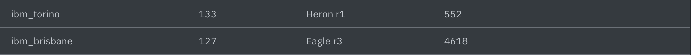

## AWS Braket 준비와 파이썬 연결 과정

IonQ를 AWS에서 사용하려면 계정/권한/리전/디바이스 선택의 네 가지를 준비합니다. 아래 단계는 제가 실제로 실험에 사용한 흐름입니다.

1) AWS 계정과 권한 준비
- AWS 콘솔에서 Braket 사용이 가능한 리전(`us-east-1` 권장)을 활성화합니다.
- IAM에서 Braket 실행 권한이 포함된 역할 또는 사용자 권한을 부여합니다. 로컬에서 실행 시 `~/.aws/credentials`에 액세스 키를 설정합니다.

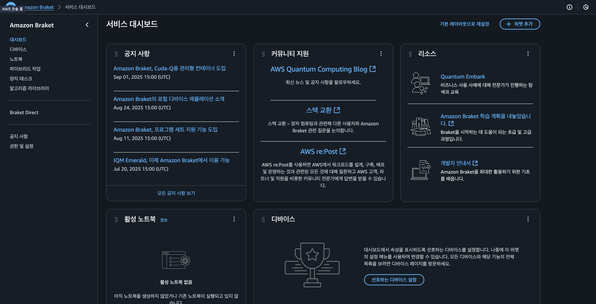

2) 디바이스 확인과 ARN 선택
- Braket 콘솔의 Devices에서 여러 Device를 확인가능합니다. 그 중 IonQ 계열 QPU의 상태를 확인하고, 사용 가능한 디바이스 ARN을 복사합니다. (예: `	
Forte 1`)

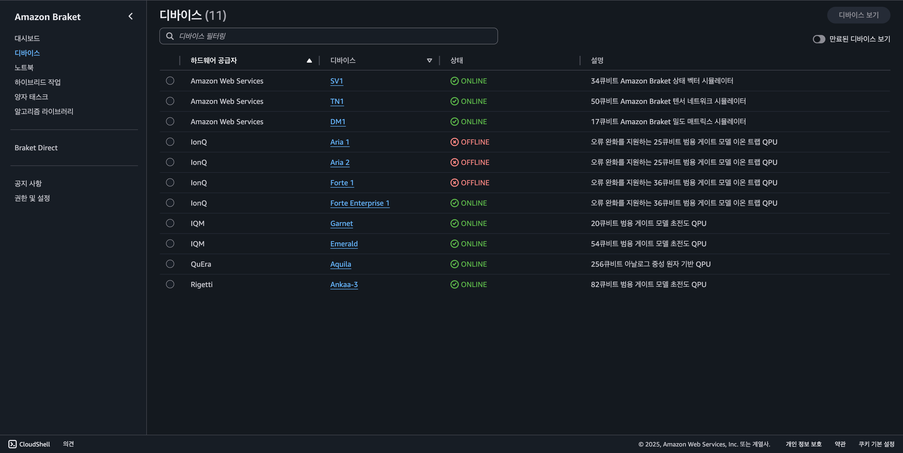
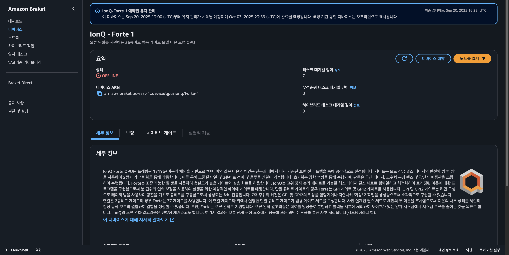

3) 개발 환경 연결(로컬)
- 로컬 파이썬에서 Braket SDK를 설치하고(`pip install amazon-braket-sdk`), 위에서 준비한 AWS 자격 증명으로 연결합니다.

<!--  -->

4) 회로 실행과 결과 조회
- 아래 코드로 작업(Task)을 제출하고, `measurement_counts`로 분포를 확인합니다. 작업 상세는 Braket 콘솔에서 모니터링할 수 있습니다.

<!--  -->

## IonQ on AWS Braket: 파이썬 코드로 벨 상태 실행

AWS에서는 Braket SDK를 사용했습니다. 실험은 `us-east-1` 리전에 있는 IonQ QPU(`Forte-1`)에서 수행했고, 동일 회로를 1024 샷으로 반복 실행해 분포를 얻었습니다.

```python
import os
import time
from braket.aws import AwsDevice
from braket.circuits import Circuit, Instruction
from braket.circuits.gates import H, CNot

DEVICE_ARN = "arn:aws:braket:us-east-1::device/qpu/ionq/Forte-1"

device = AwsDevice(DEVICE_ARN)
backend_name = type(device).__name__

circuit = Circuit()
circuit.add_instruction(Instruction(H(), [0]))
circuit.add_instruction(Instruction(CNot(), [0, 1]))
circuit.measure(0)
circuit.measure(1)

shots = int(os.getenv("BRAKET_SHOTS", "1024"))
run_kwargs = {"shots": shots}

task = device.run(circuit, **run_kwargs)

if isinstance(device, AwsDevice):
    print(f"Using device: {DEVICE_ARN} ({backend_name})")
    print(f"Submitted task: {task.id}")
    while True:
        status = task.state()
        if status in ("COMPLETED", "FAILED", "CANCELLED"):
            break
        print(f"대기 중... 상태={status}")
        time.sleep(5)
    if status != "COMPLETED":
        raise RuntimeError(f"태스크 종료 상태: {status}")

result = task.result()
counts = result.measurement_counts or {}

total_shots = sum(counts.values()) if counts else 0
print(f"Using device: {DEVICE_ARN or 'local'} ({backend_name}), shots={shots}")
if hasattr(task, "id"):
    try:
        print(f"Task ID: {task.id}")
    except Exception:
        pass
print("Counts:", counts)

if total_shots > 0:
    print("bitstring\tcount\tprob")
    for bitstring in sorted(counts.keys()):
        c = counts[bitstring]
        p = c / total_shots
        print(f"{bitstring}\t{c}\t{p:.4f}")
```

IonQ의 경우 이론적으로는 `00`과 `11`에 질량이 실리도록 기대합니다. 실제 측정치에서는 소량의 `01`/`10` 누수(leakage)가 보이는데, 이는 주로 단일/이상 게이트 에러, dephasing, SPAM(SPace And Measurement) 오류의 복합 효과로 해석했습니다.

## IBM Quantum 웹 콘솔: OpenQASM 2.0로 실행하기

이번에는 웹에서 바로 실행하는 절차입니다. IBM Quantum Composer를 사용해 OpenQASM 2.0을 붙여넣고, 백엔드를 선택해 작업을 제출했습니다.

1) 계정/프로젝트 준비
- IBM Quantum에 로그인하고 프로젝트(Instance/HUB/GROUP)에서 사용할 백엔드를 확인합니다.

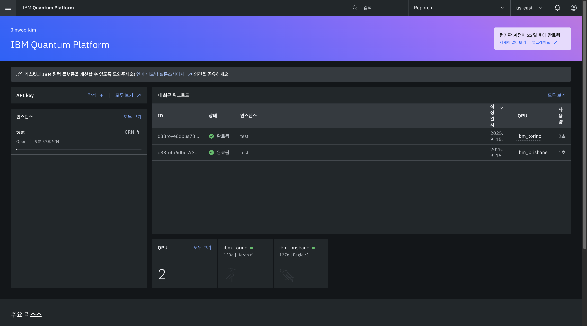

왼쪽 목록에서 `인스턴스`를 클립합니다.

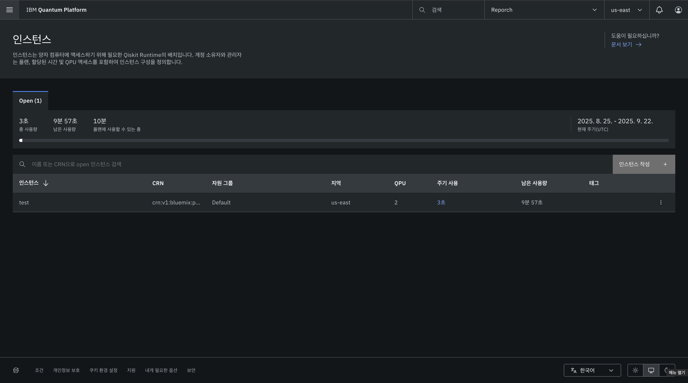

인스턴스에서 오른쪽에 `인스턴스 작성` 버튼을 누릅니다.

누르면 아래와 같은 창이 나오는데, 이름을 적고, Open( 무료 ) 선택 후 다음을 누릅니다.

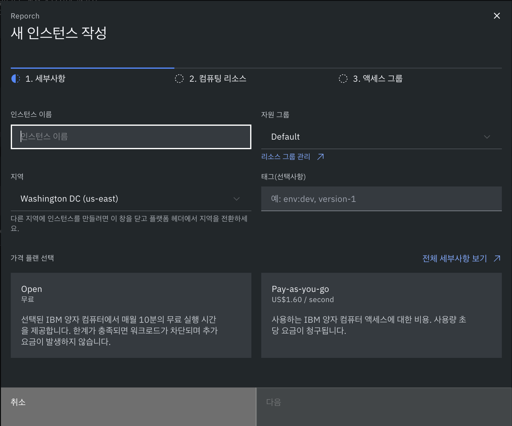

2) Composer에서 새 회로 생성
- [IBM Quantum Composer](https://quantum.cloud.ibm.com/composer)로 이동해 새 회로를 만들고, OpenQASM 모드로 전환합니다.

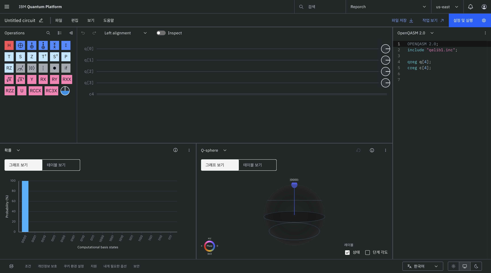

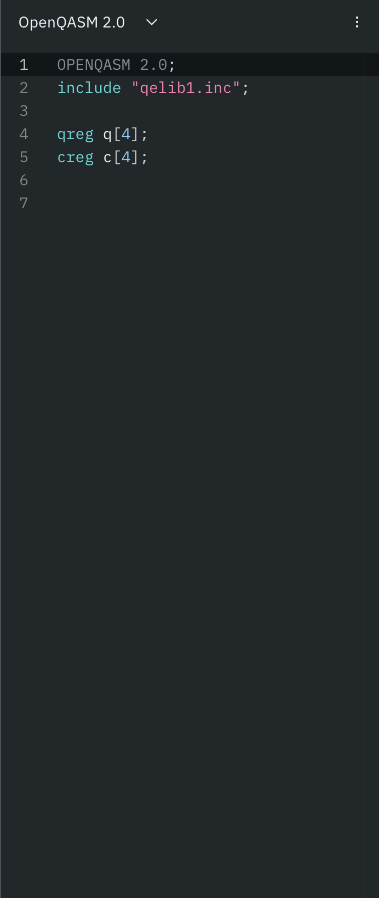

3) OpenQASM 2.0 코드 붙여넣기
- 아래 벨 상태 코드를 붙여넣습니다. 드래그앤드롭 회로 편집 대신 QASM으로 동일 회로를 정의할 수 있습니다.

4) 백엔드/샷 수 설정 후 실행
- `설정 및 실행` 버튼을 누른 후, 열린 패널에서 `IBM Brisbane` 또는 `IBM Torino`를 선택하고 샷 수를 지정한 뒤 `회로 실행`을 누르면 작업이 제출됩니다.

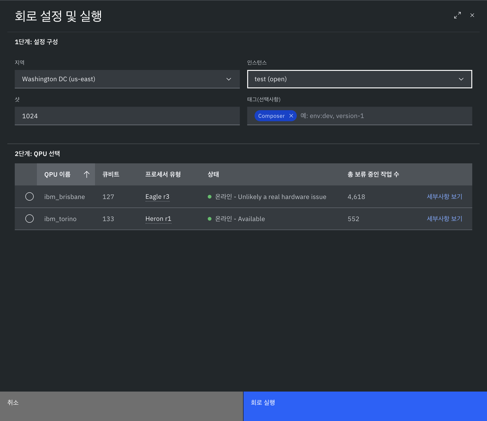

5) 결과 확인(히스토그램/로그)
- 작업이 끝나면 히스토그램과 로그에서 분포와 메타데이터(캘리브레이션 타임스탬프 등)를 확인합니다.

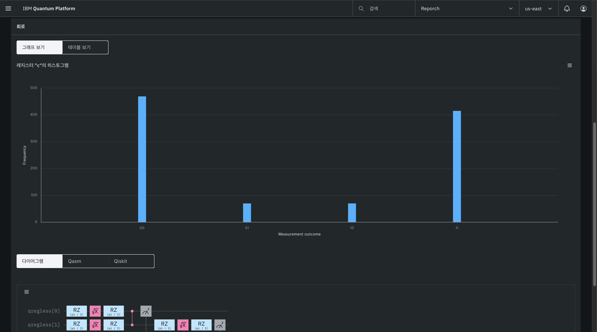

## IBM Quantum: OpenQASM 2.0으로 벨 상태 제출

IBM에서는 OpenQASM 2.0을 그대로 사용했습니다. 회로는 동일하며, `IBM Brisbane`과 `IBM Torino`에 각각 제출해 분포를 비교했습니다.

```qasm
OPENQASM 2.0;
include "qelib1.inc";

qreg q[2];
creg c[2];

h q[0];
cx q[0], q[1];

measure q[0] -> c[0];
measure q[1] -> c[1];
```

실행은 런당 수천 샷으로 설정했고, 두 백엔드 모두 캘리브레이션 최신화 직후와 일정 시간이 지난 시점에서 각각 한 번씩 재실행했습니다. Brisbane은 T1/T2가 상대적으로 안정적이었고 CNOT 에러율이 낮아 `00/11` 집중도가 높게 측정되는 경향을 보였고, Torino는 큐 대기열이 길 때 스케줄링 변동으로 미세한 왜곡이 증가하는 모습을 보였습니다. 다만 두 장비 모두 리라벨링된 결과(엔디안/비트 순서 차이)가 없도록 사후 처리 시 비트 문자열 순서를 엄격히 고정했습니다.

## 관찰과 해석

이상적인 분포는 50:50의 `00/11`이지만, 실제 데이터는 장비별 캘리브레이션 상태와 잡음 모델 차이만큼 차이를 보였습니다. IonQ(이온 트랩)는 단일 큐비트 게이트 충실도가 매우 높아 H의 균형이 잘 유지되는 반면, 얽힘 게이트의 개별 캘리브레이션 컨디션에 따라 `01/10` 꼬리가 드물게 관찰되었습니다. IBM(초전도)은 얽힘 게이트 스케줄링과 교차 토크의 영향이 민감하게 작동해 샷 수를 늘릴수록 긴 꼬리가 평균화되면서도 특정 날에는 분포 중앙이 살짝 이동하는 현상(편향)이 보이기도 했습니다.

<!-- 

 -->

## 재현 방법과 주의사항

- 동일한 회로라도 계정/리전에 따라 QPU ARN이 달라집니다. 제출 전 자신의 콘솔에서 활성화된 디바이스 ARN을 확인하세요.
- IBM 백엔드는 런타임 옵션과 큐 상황에 따라 대기 시간이 크게 달라집니다. 이번 실험은 대기열과 캘리브레이션 타이밍을 기록해 결과와 함께 보관했습니다.
- 비트 문자열 정렬(LSB/MSB) 규칙을 통일하지 않으면 플랫폼 간 분포 비교에서 허위 차이가 생길 수 있습니다.

## 마치며

결론적으로, 같은 벨 상태라도 하드웨어 특성에 따른 잡음과 보정의 차이가 측정 분포에 고스란히 반영된다는 점을 다시 확인했습니다. IonQ와 IBM 모두 최근 캘리브레이션이 양호한 시점에는 `00/11` 집중도가 매우 높게 재현되었고, 반대로 큐 대기와 환경 변동이 컸던 세션에서는 꼬리가 두꺼워지는 경향을 보였습니다.


